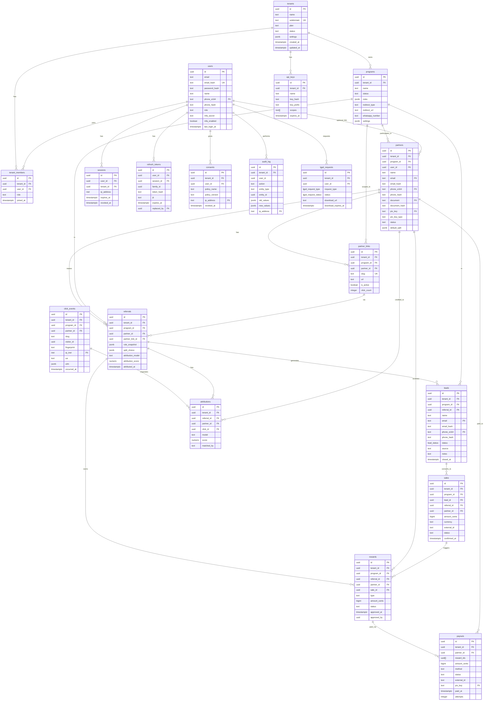

# Indica AÍ! — Database Schema (v1.0)

> Documento produzido por @db-chief | 2026-05-12
> Dependências lidas: `docs/product-spec.md`, `docs/architecture.md` (§3, §4, §5, §7.2, §7.6, Anexo B)
> Stack: PostgreSQL 16, sqlc, golang-migrate, pgx v5, RLS, UUIDv7 (google/uuid)

---

## 1. ERD (Mermaid)



---

## 2. Tabela-por-Tabela

### 2.1 `tenants`

| Coluna | Tipo | Constraint | Justificativa |
|--------|------|-----------|---------------|
| `id` | `uuid` | PK, DEFAULT gen_random_uuid() | UUIDv7 gerado na app layer via google/uuid. gen_random_uuid() é fallback. |
| `name` | `text` | NOT NULL | Nome da empresa exibido no dashboard. |
| `subdomain` | `text` | NOT NULL, UNIQUE (lower) | Subdomínio para acesso (empresa.indica.ai). Index Btree em lower(). |
| `logo_url` | `text` | | URL do logo no R2/CDN. |
| `plan` | `text` | NOT NULL, DEFAULT 'free' | Plano atual (free, starter, pro, enterprise). |
| `status` | `text` | NOT NULL, CHECK IN (...) | active, suspended, cancelled. |
| `settings` | `jsonb` | NOT NULL, DEFAULT '{}' | timezone, locale, webhook_url, custom branding. |
| `created_at` | `timestamptz` | NOT NULL, DEFAULT now() | |
| `updated_at` | `timestamptz` | NOT NULL, DEFAULT now() | Auto-atualizado via trigger. |

**RLS:** Não aplicável. Tabela global gerenciada pelo SaaS admin.

**Decisão:** `plan` como text (não enum) para facilitar adição de planos sem migration.

---

### 2.2 `users`

| Coluna | Tipo | Constraint | Justificativa |
|--------|------|-----------|---------------|
| `id` | `uuid` | PK | UUIDv7 na app layer. |
| `email` | `text` | NOT NULL | PII; retention=5y. |
| `email_hash` | `text` | NOT NULL, UNIQUE | sha256(lower(email)). Permite lookup sem expor email em índices. |
| `email_verified` | `boolean` | NOT NULL, DEFAULT false | |
| `password_hash` | `text` | | Argon2id. Null para magic-link users. |
| `name` | `text` | NOT NULL | |
| `phone_e164` | `text` | | PII; retention=5y. Formato E.164. |
| `phone_hash` | `text` | | sha256(phone_e164). Index parcial WHERE NOT NULL. |
| `avatar_url` | `text` | | |
| `role` | `text` | NOT NULL, CHECK IN (user, saas_admin) | saas_admin bypass RLS via Postgres role. |
| `mfa_secret` | `text` | | TOTP secret. Encriptação na app layer obrigatória. |
| `mfa_enabled` | `boolean` | NOT NULL, DEFAULT false | |
| `last_login_at` | `timestamptz` | | |

**RLS:** Não aplicável. Usuário pode pertencer a N tenants. Acesso controlado via `tenant_members`.

**Índices:**
- `users_email_hash_idx` — UNIQUE, lookup por email
- `users_phone_hash_idx` — parcial (WHERE phone_hash IS NOT NULL)

---

### 2.3 `tenant_members`

| Coluna | Tipo | Constraint | Justificativa |
|--------|------|-----------|---------------|
| `id` | `uuid` | PK | |
| `tenant_id` | `uuid` | NOT NULL, FK → tenants(id) CASCADE | |
| `user_id` | `uuid` | NOT NULL, FK → users(id) CASCADE | |
| `role` | `text` | NOT NULL, CHECK IN (owner, admin, member, viewer) | Papel do user dentro do tenant. |
| `invited_at` | `timestamptz` | NOT NULL, DEFAULT now() | |
| `joined_at` | `timestamptz` | | Null = convite pendente. |

**RLS:** Habilitado. Policy USING tenant_id = current_setting('app.current_tenant').

**Constraint:** UNIQUE(tenant_id, user_id) — um user não pode ser membro duplicado.

---

### 2.4 `sessions`

| Coluna | Tipo | Constraint | Justificativa |
|--------|------|-----------|---------------|
| `id` | `uuid` | PK | |
| `user_id` | `uuid` | NOT NULL, FK → users(id) CASCADE | |
| `tenant_id` | `uuid` | FK → tenants(id) CASCADE | Null = sessão global (saas_admin). |
| `ip_address` | `inet` | | |
| `user_agent` | `text` | | |
| `expires_at` | `timestamptz` | NOT NULL | |
| `revoked_at` | `timestamptz` | | Null = ativa. |

**RLS:** Não aplicável. Acesso controlado por user_id na app layer.

---

### 2.5 `refresh_tokens`

| Coluna | Tipo | Constraint | Justificativa |
|--------|------|-----------|---------------|
| `id` | `uuid` | PK | |
| `user_id` | `uuid` | NOT NULL, FK → users(id) CASCADE | |
| `session_id` | `uuid` | FK → sessions(id) CASCADE | |
| `tenant_id` | `uuid` | FK → tenants(id) CASCADE | |
| `family_id` | `uuid` | NOT NULL | Agrupa rotação. Mesmo family = mesmo login. |
| `token_hash` | `text` | NOT NULL, UNIQUE | sha256 do token. Nunca armazenar token puro. |
| `jti` | `text` | NOT NULL | JWT ID para matching. |
| `expires_at` | `timestamptz` | NOT NULL | |
| `revoked_at` | `timestamptz` | | |
| `replaced_by` | `uuid` | FK → refresh_tokens(id) | Token que substituiu este na rotação. |

**RLS:** Não aplicável. Acesso por token_hash.

**Anti-theft:** Se um token revocado é usado, toda a family é revogada (token theft detection).

---

### 2.6 `api_keys`

| Coluna | Tipo | Constraint | Justificativa |
|--------|------|-----------|---------------|
| `id` | `uuid` | PK | |
| `tenant_id` | `uuid` | NOT NULL, FK → tenants(id) CASCADE | |
| `name` | `text` | NOT NULL | Nome amigável ("Integração ERP"). |
| `key_hash` | `text` | NOT NULL, UNIQUE | Argon2id hash da chave. |
| `key_prefix` | `text` | NOT NULL | Primeiros 8 chars para identificação no UI. |
| `scopes` | `text[]` | NOT NULL, DEFAULT '{}' | Permissões granulares. |
| `last_used_at` | `timestamptz` | | |
| `expires_at` | `timestamptz` | | Null = sem expiração. |
| `revoked_at` | `timestamptz` | | |
| `created_by` | `uuid` | FK → users(id) | |

**RLS:** Habilitado. Policy USING tenant_id.

---

### 2.7 `programs`

| Coluna | Tipo | Constraint | Justificativa |
|--------|------|-----------|---------------|
| `id` | `uuid` | PK | |
| `tenant_id` | `uuid` | NOT NULL, FK → tenants(id) CASCADE | |
| `name` | `text` | NOT NULL | "Programa de Indicação Wenox". |
| `description` | `text` | | |
| `status` | `text` | NOT NULL, CHECK IN (draft, active, paused, archived) | |
| `rules` | `jsonb` | NOT NULL | Motor de regras versionado. Ver architecture.md §4.2. |
| `redirect_type` | `text` | NOT NULL, CHECK IN (website, whatsapp, landing, checkout) | |
| `redirect_url` | `text` | | Destino após clique. |
| `whatsapp_number` | `text` | | Se redirect_type = whatsapp. |
| `settings` | `jsonb` | NOT NULL, DEFAULT '{}' | Branding, campos customizados. |

**RLS:** Habilitado. Policy USING tenant_id.

**Decisão:** `rules` como JSONB (não tabela relacional) permite adicionar tipos de recompensa sem migration. Schema validado na app layer via JSON Schema.

---

### 2.8 `partners`

| Coluna | Tipo | Constraint | Justificativa |
|--------|------|-----------|---------------|
| `id` | `uuid` | PK | |
| `tenant_id` | `uuid` | NOT NULL, FK → tenants(id) CASCADE | |
| `program_id` | `uuid` | NOT NULL, FK → programs(id) CASCADE | |
| `user_id` | `uuid` | FK → users(id) SET NULL | Parceiro pode ser user registrado. |
| `name` | `text` | NOT NULL | |
| `email` | `text` | | PII; retention=5y. |
| `email_hash` | `text` | | sha256(lower(email)). |
| `phone_e164` | `text` | | PII; retention=5y. |
| `phone_hash` | `text` | | sha256(phone_e164). |
| `document` | `text` | | CPF/CNPJ. PII; retention=5y. |
| `document_hash` | `text` | | sha256(document). |
| `pix_key` | `text` | | PII; retention=5y. |
| `pix_key_type` | `text` | CHECK IN (cpf, cnpj, email, phone, random) | |
| `status` | `text` | NOT NULL, CHECK IN (active, suspended, blocked) | |
| `default_split` | `jsonb` | | Preferência de split para flexible_split. |

**RLS:** Habilitado. Policy USING tenant_id.

**Constraints:** UNIQUE(tenant_id, program_id, email_hash) e UNIQUE(tenant_id, program_id, phone_hash) — dedup por programa.

**Decisão:** `document` (CPF/CNPJ) como text, não validado no DB — validação na app layer. Hash para lookup sem expor PII.

---

### 2.9 `partner_links`

| Coluna | Tipo | Constraint | Justificativa |
|--------|------|-----------|---------------|
| `id` | `uuid` | PK | |
| `tenant_id` | `uuid` | NOT NULL, FK → tenants(id) CASCADE | |
| `program_id` | `uuid` | NOT NULL, FK → programs(id) CASCADE | |
| `partner_id` | `uuid` | NOT NULL, FK → partners(id) CASCADE | |
| `slug` | `text` | NOT NULL, UNIQUE (global) | Slug único global para /r/:slug. |
| `url` | `text` | NOT NULL | URL completa de redirect. |
| `is_active` | `boolean` | NOT NULL, DEFAULT true | |
| `click_count` | `integer` | NOT NULL, DEFAULT 0 | Denormalizado. Atualizado async. |

**RLS:** Habilitado. Policy USING tenant_id.

**Hot path:** `/r/:slug` → lookup por slug (UNIQUE index). Este é o path mais quente do sistema. Slug Btree index dá O(1).

---

### 2.10 `referrals`

| Coluna | Tipo | Constraint | Justificativa |
|--------|------|-----------|---------------|
| `id` | `uuid` | PK | |
| `tenant_id` | `uuid` | NOT NULL, FK → tenants(id) CASCADE | |
| `program_id` | `uuid` | NOT NULL, FK → programs(id) CASCADE | |
| `partner_id` | `uuid` | NOT NULL, FK → partners(id) CASCADE | |
| `partner_link_id` | `uuid` | FK → partner_links(id) SET NULL | |
| `rule_snapshot` | `jsonb` | NOT NULL | Snapshot da regra no momento da criação. Imutável. |
| `split_choice` | `jsonb` | | Escolha do parceiro em flexible_split. |
| `attribution_model` | `text` | NOT NULL, DEFAULT 'last_touch' | |
| `attribution_score` | `numeric(3,2)` | NOT NULL, DEFAULT 0 | 0.00 a 1.00. |
| `attributed_at` | `timestamptz` | | Quando a atribuição foi confirmada. |

**RLS:** Habilitado. Policy USING tenant_id.

**Decisão crítica:** `rule_snapshot` é cópia imutável. Mudar a regra do programa **não** retroage referrals existentes. Isso é essencial para previsibilidade e auditoria.

---

### 2.11 `leads`

| Coluna | Tipo | Constraint | Justificativa |
|--------|------|-----------|---------------|
| `id` | `uuid` | PK | |
| `tenant_id` | `uuid` | NOT NULL, FK → tenants(id) CASCADE | |
| `program_id` | `uuid` | NOT NULL, FK → programs(id) CASCADE | |
| `referral_id` | `uuid` | FK → referrals(id) SET NULL | |
| `name` | `text` | | |
| `email` | `text` | | PII; retention=5y. |
| `email_hash` | `text` | | sha256(lower(email)). |
| `phone_e164` | `text` | | PII; retention=5y. |
| `phone_hash` | `text` | NOT NULL | sha256(phone_e164). NOT NULL — telefone é identificador primário. |
| `status` | `lead_status` | NOT NULL, DEFAULT 'new' | Enum tipado. |
| `source` | `text` | NOT NULL, CHECK IN (referral, manual, whatsapp, import, widget) | |
| `notes` | `text` | | Notas do atendente. |
| `closed_at` | `timestamptz` | | Preenchido quando status = 'closed'. |

**RLS:** Habilitado. Policy USING tenant_id.

**Dedup:** UNIQUE(program_id, phone_hash) — mesmo telefone = mesmo lead no programa.

**State machine:** new → in_progress → qualified → closed | lost. Transições controladas na app layer.

---

### 2.12 `sales`

| Coluna | Tipo | Constraint | Justificativa |
|--------|------|-----------|---------------|
| `id` | `uuid` | PK | |
| `tenant_id` | `uuid` | NOT NULL, FK → tenants(id) CASCADE | |
| `program_id` | `uuid` | NOT NULL, FK → programs(id) CASCADE | |
| `lead_id` | `uuid` | NOT NULL, FK → leads(id) CASCADE | |
| `referral_id` | `uuid` | FK → referrals(id) SET NULL | |
| `partner_id` | `uuid` | FK → partners(id) SET NULL | |
| `amount_cents` | `bigint` | NOT NULL | Valor em centavos. 10000 = R$100,00. |
| `currency` | `text` | NOT NULL, DEFAULT 'BRL' | |
| `external_id` | `text` | | ID da venda no ERP/CRM do cliente. |
| `status` | `text` | NOT NULL, CHECK IN (pending, confirmed, refunded, cancelled) | |
| `confirmed_at` | `timestamptz` | | |

**RLS:** Habilitado. Policy USING tenant_id.

**Decisão:** `amount_cents` como bigint (não numeric/float) para evitar erros de arredondamento financeiro.

---

### 2.13 `rewards`

| Coluna | Tipo | Constraint | Justificativa |
|--------|------|-----------|---------------|
| `id` | `uuid` | PK | |
| `tenant_id` | `uuid` | NOT NULL, FK → tenants(id) CASCADE | |
| `program_id` | `uuid` | NOT NULL, FK → programs(id) CASCADE | |
| `referral_id` | `uuid` | NOT NULL, FK → referrals(id) CASCADE | |
| `partner_id` | `uuid` | NOT NULL, FK → partners(id) CASCADE | |
| `sale_id` | `uuid` | FK → sales(id) SET NULL | Null para goal_based que não dependem de venda específica. |
| `type` | `text` | NOT NULL, CHECK IN (...) | Tipo de recompensa (espelha reward.type do rules JSONB). |
| `amount_cents` | `bigint` | NOT NULL, DEFAULT 0 | Valor em centavos. |
| `currency` | `text` | NOT NULL, DEFAULT 'BRL' | |
| `status` | `text` | NOT NULL, CHECK IN (pending, approved, rejected, cancelled, paid) | |
| `approved_at` | `timestamptz` | | |
| `approved_by` | `uuid` | FK → users(id) | Admin que aprovou. |
| `rejected_reason` | `text` | | |
| `metadata` | `jsonb` | NOT NULL, DEFAULT '{}' | Detalhes do cálculo. |

**RLS:** Habilitado. Policy USING tenant_id.

---

### 2.14 `payouts`

| Coluna | Tipo | Constraint | Justificativa |
|--------|------|-----------|---------------|
| `id` | `uuid` | PK | |
| `tenant_id` | `uuid` | NOT NULL, FK → tenants(id) CASCADE | |
| `partner_id` | `uuid` | NOT NULL, FK → partners(id) CASCADE | |
| `reward_ids` | `uuid[]` | NOT NULL | Array de rewards incluídas. |
| `amount_cents` | `bigint` | NOT NULL | Total em centavos. |
| `currency` | `text` | NOT NULL, DEFAULT 'BRL' | |
| `method` | `text` | NOT NULL, CHECK IN (pix, bank_transfer, credit, coupon, physical, manual) | |
| `status` | `text` | NOT NULL, CHECK IN (pending, processing, paid, failed, cancelled) | |
| `external_id` | `text` | | ID no gateway (Asaas). |
| `pix_key` | `text` | | Snapshot da chave Pix no momento do pagamento. PII. |
| `pix_key_type` | `text` | | |
| `paid_at` | `timestamptz` | | |
| `failed_at` | `timestamptz` | | |
| `failure_reason` | `text` | | |
| `attempts` | `integer` | NOT NULL, DEFAULT 0 | |
| `next_retry_at` | `timestamptz` | | Index parcial para retry. |

**RLS:** Habilitado. Policy USING tenant_id.

**Retry:** Index parcial `WHERE status = 'failed' AND next_retry_at IS NOT NULL` para job de retry.

---

### 2.15 `click_events`

| Coluna | Tipo | Constraint | Justificativa |
|--------|------|-----------|---------------|
| `id` | `uuid` | NOT NULL, DEFAULT gen_random_uuid() | PK composta com occurred_at. |
| `tenant_id` | `uuid` | NOT NULL | |
| `program_id` | `uuid` | NOT NULL | |
| `partner_id` | `uuid` | NOT NULL | |
| `slug` | `text` | NOT NULL | Slug usado no clique (denormalizado para queries diretas). |
| `visitor_id` | `uuid` | NOT NULL | UUIDv7 do cookie _iaref. |
| `fingerprint` | `text` | NOT NULL | sha256(ip_/24 + ua + accept_lang + tenant_id). |
| `ip_inet` | `inet` | | PII; retention=12m. |
| `ua` | `text` | | User agent completo. |
| `accept_lang` | `text` | | |
| `referer` | `text` | | |
| `utm` | `jsonb` | | {source, medium, campaign, term, content}. |
| `occurred_at` | `timestamptz` | NOT NULL, DEFAULT now() | |

**RLS:** Habilitado. Policy USING tenant_id.

**PK composta:** `(id, occurred_at)` — necessária para particionamento por range em `occurred_at`.

**Índices (hot paths):**
- `click_events_visitor_idx` — (visitor_id, occurred_at DESC) — busca de cliques por visitante para atribuição
- `click_events_fingerprint_idx` — (fingerprint, occurred_at DESC) — fallback de atribuição
- `click_events_partner_idx` — (partner_id, occurred_at DESC) — métricas do parceiro
- `click_events_slug_idx` — (slug, occurred_at DESC) — analytics por link
- `click_events_tenant_program_idx` — (tenant_id, program_id, occurred_at DESC) — queries administrativas

---

### 2.16 `attributions`

| Coluna | Tipo | Constraint | Justificativa |
|--------|------|-----------|---------------|
| `id` | `uuid` | PK | |
| `tenant_id` | `uuid` | NOT NULL, FK → tenants(id) CASCADE | |
| `referral_id` | `uuid` | NOT NULL, FK → referrals(id) CASCADE | |
| `partner_id` | `uuid` | NOT NULL, FK → partners(id) CASCADE | |
| `click_id` | `uuid` | | Referência ao click_event. Null = atribuição direta por código. |
| `model` | `text` | NOT NULL, CHECK IN (last_touch, first_touch, linear, custom) | |
| `score` | `numeric(3,2)` | NOT NULL, DEFAULT 0 | Confiança: code=1.0, cookie=0.85, fingerprint=0.4. |
| `matched_by` | `text` | NOT NULL, CHECK IN (code, cookie, fingerprint, manual) | |
| `reason` | `text` | | Justificativa para matched_by = 'manual'. |

**RLS:** Habilitado. Policy USING tenant_id.

---

### 2.17 `consents`

| Coluna | Tipo | Constraint | Justificativa |
|--------|------|-----------|---------------|
| `id` | `uuid` | PK | |
| `tenant_id` | `uuid` | FK → tenants(id) CASCADE | Null = consentimento global da plataforma. |
| `user_id` | `uuid` | FK → users(id) SET NULL | Null = visitante não-logado. |
| `visitor_id` | `uuid` | | Identificador de visitante não-logado. |
| `policy_name` | `text` | NOT NULL | privacy_policy, terms_of_service, cookie_policy. |
| `policy_version` | `text` | NOT NULL | Versão do documento aceito. |
| `policy_url` | `text` | | URL do documento. |
| `accepted_at` | `timestamptz` | NOT NULL, DEFAULT now() | |
| `ip_address` | `inet` | | PII; retention=5y. |
| `user_agent` | `text` | | |
| `revoked_at` | `timestamptz` | | Null = ativo. |

**RLS:** Habilitado. Policy USING tenant_id.

**LGPD:** Append-only. Nunca deletar — apenas marcar `revoked_at`.

---

### 2.18 `audit_log`

| Coluna | Tipo | Constraint | Justificativa |
|--------|------|-----------|---------------|
| `id` | `uuid` | NOT NULL, DEFAULT gen_random_uuid() | PK composta com created_at. |
| `tenant_id` | `uuid` | NOT NULL | |
| `user_id` | `uuid` | | Null = ação do sistema. |
| `action` | `text` | NOT NULL | lead.created, payout.approved, user.login, data.exported. |
| `entity_type` | `text` | NOT NULL | lead, payout, user, partner. |
| `entity_id` | `uuid` | | |
| `old_values` | `jsonb` | | Snapshot anterior (updates). |
| `new_values` | `jsonb` | | Snapshot novo. |
| `ip_address` | `inet` | | PII; retention=5y. |
| `user_agent` | `text` | | |
| `metadata` | `jsonb` | NOT NULL, DEFAULT '{}' | |

**RLS:** Habilitado. Policy USING tenant_id.

**Append-only:** Nunca UPDATE/DELETE. Enforcement via app layer (INSERT only).

---

### 2.19 `lgpd_requests`

| Coluna | Tipo | Constraint | Justificativa |
|--------|------|-----------|---------------|
| `id` | `uuid` | PK | |
| `tenant_id` | `uuid` | FK → tenants(id) CASCADE | Null = request global. |
| `user_id` | `uuid` | FK → users(id) SET NULL | |
| `request_type` | `lgpd_request_type` | NOT NULL | export, erase, rectify, access. |
| `status` | `lgpd_request_status` | NOT NULL, DEFAULT 'pending' | pending, processing, completed, failed, cancelled. |
| `requested_at` | `timestamptz` | NOT NULL, DEFAULT now() | |
| `processed_at` | `timestamptz` | | |
| `processed_by` | `uuid` | FK → users(id) | Admin que processou. |
| `download_url` | `text` | | URL assinada R2. Expira em 7 dias. |
| `download_expires_at` | `timestamptz` | | |
| `failure_reason` | `text` | | |

**RLS:** Habilitado. Policy USING tenant_id.

---

## 3. Estratégia de UUIDv7 vs gen_random_uuid()

### Decisão

| Contexto | UUID usado | Justificativa |
|----------|-----------|---------------|
| **IDs gerados na app layer** (Go + google/uuid) | **UUIDv7** | Ordenável por tempo → Btree index eficiente, sem page splits, melhor insert performance em tabelas de alto volume. |
| **DEFAULT no DB** (fallback) | `gen_random_uuid()` (v4) | Usado quando row é criada direto no DB (migrations, seeds, SQL manual). UUIDv4 é aceitável em baixo volume. |
| **visitor_id** (cookie) | **UUIDv7** | Gerado pelo edge worker. Ordenável permite range queries por tempo. |
| **family_id** (refresh tokens) | `gen_random_uuid()` | Não precisa ser ordenável. |

### Implementação no Go

```go
import "github.com/google/uuid"

// UUIDv7 — monotonic, time-ordered
id, err := uuid.NewV7()
// Resultado: 0192a3f4-7b2d-7xxx-xxxx-xxxxxxxxxxxx
//             ^timestamp^ ^random^
```

### Por que UUIDv7 > UUIDv4 para Btree

- UUIDv4 é aleatório → inserts em posições aleatórias → page splits → write amplification
- UUIDv7 tem timestamp nos primeiros 48 bits → inserts sequenciais → append-only Btree → menos I/O
- Em tabelas com milhões de rows (click_events, audit_log), a diferença é significativa

### Exceção: click_events

`click_events` usa PK composta `(id, occurred_at)` para habilitar particionamento por range. O `id` pode ser UUIDv7 mas o particionamento é por `occurred_at`.

---

## 4. Estratégia de Particionamento de `click_events`

### Quando ativar

| Métrica | Threshold | Ação |
|---------|-----------|------|
| Total de rows | > 10M | Avaliar particionamento |
| Insert rate | > 1000/s sustentados | Ativar |
| Query latency degrades | P95 > 200ms em queries por período | Ativar |
| Storage | > 50GB em click_events | Ativar + considerar compressão |

### Como implementar

```sql
-- Migration futura: converter click_events em particionada por range
CREATE TABLE click_events_partitioned (
    LIKE click_events INCLUDING ALL
) PARTITION BY RANGE (occurred_at);

-- Partição mensal
CREATE TABLE click_events_2026_01 PARTITION OF click_events_partitioned
    FOR VALUES FROM ('2026-01-01') TO ('2026-02-01');
CREATE TABLE click_events_2026_02 PARTITION OF click_events_partitioned
    FOR VALUES FROM ('2026-02-01') TO ('2026-03-01');
-- ... automático via pg_partman ou script

-- Partição default para dados futuros
CREATE TABLE click_events_default PARTITION OF click_events_partitioned DEFAULT;
```

### Manutenção

- **Criação automática:** pg_partman ou script cron que cria partição 2 meses à frente
- **Retenção:** DROP PARTITION de partições > 12 meses (mais eficiente que DELETE)
- **Índices:** Cada partição tem seus próprios índices (menor Btree por partição)

### Alternativa: compressão

Se storage for o gargalo antes de latency:
```sql
-- Ativar TOAST compression em colunas de texto
ALTER TABLE click_events ALTER COLUMN ua SET STORAGE EXTERNAL;
-- Ou usar extensão pg_compression para partições antigas
```

---

## 5. Estratégia de Performance

### 5.1 Índices

| Tabela | Índice | Tipo | Justificativa |
|--------|--------|------|---------------|
| `tenants` | `subdomain` | Btree UNIQUE (lower) | Lookup por subdomínio no middleware. |
| `users` | `email_hash` | Btree UNIQUE | Login por email. |
| `users` | `phone_hash` | Btree parcial (WHERE NOT NULL) | Lookup por telefone. |
| `tenant_members` | `(tenant_id, user_id)` | Btree UNIQUE | Verificação de membership. |
| `partner_links` | `slug` | Btree UNIQUE | **Hot path #1:** /r/:slug lookup. |
| `click_events` | `(visitor_id, occurred_at DESC)` | Btree | **Hot path #2:** atribuição por visitor. |
| `click_events` | `(fingerprint, occurred_at DESC)` | Btree | **Hot path #3:** atribuição por fingerprint. |
| `click_events` | `(partner_id, occurred_at DESC)` | Btree | Métricas do parceiro. |
| `click_events` | `(tenant_id, program_id, occurred_at DESC)` | Btree | Queries admin. |
| `leads` | `(program_id, phone_hash)` | Btree UNIQUE | Dedup de leads. |
| `leads` | `(tenant_id, status)` | Btree | Listagem por status. |
| `rewards` | `(tenant_id, status)` | Btree | Listagem de pendentes. |
| `payouts` | `(tenant_id, status)` | Btree | Listagem de pendentes. |
| `payouts` | `(next_retry_at)` | Btree parcial (WHERE failed + next_retry) | Job de retry. |
| `audit_log` | `(tenant_id, created_at DESC)` | Btree | Listagem cronológica. |
| `audit_log` | `(tenant_id, entity_type, entity_id, created_at DESC)` | Btree | Histórico de entidade. |

### 5.2 Hot Paths e Otimizações

**Path 1: GET /r/:slug (clique de indicação)**
- Query: `SELECT ... FROM partner_links WHERE slug = $1`
- Index: Btree UNIQUE em `slug` → O(1)
- Cache: Cloudflare Worker KV cacheia slug→destination (TTL 5min)
- Fallback: Se cache miss, query ao DB

**Path 2: Atribuição de conversão (job async)**
- Query: `SELECT ... FROM click_events WHERE visitor_id = $1 OR fingerprint = $2 ORDER BY occurred_at DESC`
- Index: Dois índices separados, merge na aplicação
- Otimização: LIMIT 10 (só precisamos do mais recente)
- Janela: `occurred_at >= NOW() - INTERVAL '30 days'` (configurável por programa)

**Path 3: Agregação de comissão por parceiro**
- Query: `SELECT SUM(amount_cents) FROM rewards WHERE partner_id = $1 AND status = 'approved'`
- Index: `(partner_id, status)` — permite Index Scan
- Otimização futura: Materialized view `partner_rewards_summary` atualizada a cada 5min

**Path 4: Listagem de leads por status**
- Query: `SELECT ... FROM leads WHERE tenant_id = $1 AND status = $2 ORDER BY created_at DESC`
- Index: `(tenant_id, status)` + ORDER BY created_at DESC
- Paginação: LIMIT/OFFSET (cursor-based para >10k results)

### 5.3 Extensões e Otimizações Futuras

| Técnica | Quando ativar | Como |
|---------|---------------|------|
| **pg_trgm** | Busca fuzzy de parceiros por nome >50k registros | `CREATE EXTENSION pg_trgm; CREATE INDEX ... USING gin(name gin_trgm_ops);` |
| **Partial indexes** | Queries frequentes filtram por status fixo | `CREATE INDEX ... WHERE status = 'pending'` (já feito em payouts/rewards) |
| **Materialized views** | Dashboards agregados lentos (>2s) | `CREATE MATERIALIZED VIEW partner_rewards_summary AS SELECT ...` + REFRESH CONCURRENTLY |
| **BRIN indexes** | click_events >100M rows, queries por range de tempo | `CREATE INDEX ... USING brin(occurred_at)` — muito menor que Btree |
| **Connection pool tuning** | >100 concurrent connections | PgBouncer transaction mode, pool_size = 2 * CPU cores |
| **Read replicas** | Queries analíticas competem com OLTP | Replica read-only para dashboards e reports |

---

## 6. PII e Retenção

### Campos marcados como PII

| Tabela | Campo | Tipo PII | Retenção |
|--------|-------|----------|----------|
| `users` | `email` | Contato | 5y |
| `users` | `phone_e164` | Contato | 5y |
| `partners` | `email` | Contato | 5y |
| `partners` | `phone_e164` | Contato | 5y |
| `partners` | `document` | CPF/CNPJ | 5y |
| `partners` | `pix_key` | Financeiro | 5y |
| `leads` | `email` | Contato | 5y |
| `leads` | `phone_e164` | Contato | 5y |
| `click_events` | `ip_inet` | Identificador de rede | 12m |
| `consents` | `ip_address` | Identificador de rede | 5y |
| `audit_log` | `ip_address` | Identificador de rede | 5y |
| `payouts` | `pix_key` | Financeiro | 5y (snapshot) |

### Estratégia de anonimização (LGPD erase)

Quando `lgpd_requests` de tipo `erase` é processado:
1. `users`: email → `anon+{id}@deleted`, phone → NULL, name → 'Anonimizado'
2. `partners`: email → NULL, phone → NULL, document → NULL, pix_key → NULL
3. `leads`: email → NULL, phone_e164 → NULL, name → NULL
4. `click_events`: ip_inet → NULL, ua → NULL
5. **Manter:** phone_hash, email_hash (para integridade de dedup), amount_cents (integridade fiscal)
6. `consents`: nunca deletar (evidência de consentimento)
7. `audit_log`: nunca deletar (evidência legal)

---

## 7. Validação dos 3 Casos de Uso

### Caso 1 — Wenox 20% flexível

```json
// programs.rules
{
  "schema_version": 1,
  "trigger": "sale.confirmed",
  "attribution_window_days": 30,
  "conditions": [{"op": "eq", "field": "lead.status", "value": "closed"}],
  "reward": {
    "type": "flexible_split",
    "max_pct": 20,
    "decision_by": "partner",
    "options": [
      {"commission_pct": 20, "discount_pct": 0},
      {"commission_pct": 10, "discount_pct": 10},
      {"commission_pct": 0, "discount_pct": 20},
      {"kind": "custom", "max_total_pct": 20}
    ]
  }
}
```

- `referrals.split_choice` armazena a escolha: `{"commission_pct": 10, "discount_pct": 10}`
- `rewards.metadata` armazena o cálculo: `{"sale_amount_cents": 100000, "commission_cents": 10000, "discount_cents": 10000}`
- Schema cabe sem mudança estrutural.

### Caso 2 — Ótica meta (5 indicações = óculos)

```json
{
  "reward": {
    "type": "goal_based",
    "target": 5,
    "counting": {"scope": "per_partner", "status_required": "closed"},
    "payout": {"kind": "physical", "sku": "oculos_modelo_x"}
  }
}
```

- `rewards.type = 'goal_based'`, `rewards.amount_cents = 0` (brinde)
- `rewards.metadata`: `{"goal_target": 5, "goal_current": 3, "sku": "oculos_modelo_x"}`
- Worker `goal_evaluator` conta `referrals WHERE partner_id = X AND status = 'closed'`

### Caso 3 — Ótica R$100 Pix

```json
{
  "reward": {"type": "commission_fixed", "amount_brl": 100},
  "payout": {"method": "pix", "schedule": "on_approval"}
}
```

- `rewards.type = 'commission_fixed'`, `rewards.amount_cents = 10000`
- `payouts.method = 'pix'`, `payouts.amount_cents = 10000`
- `payouts.pix_key` snapshot da chave do parceiro no momento do pagamento

**Conclusão:** Os 3 casos cabem no schema sem mudança estrutural — apenas configuração via `rules` JSONB.

---

## 8. Checklist de Validação (Anexo B do architecture.md)

- [x] Toda tabela de domínio tem `tenant_id uuid NOT NULL`
- [x] RLS habilitado + FORCE ROW LEVEL SECURITY em todas as tabelas de domínio
- [x] Policy `USING tenant_id = current_setting('app.current_tenant', true)::uuid`
- [x] Exceções documentadas: tenants, users, sessions, refresh_tokens
- [x] Snapshot de regra: `referrals.rule_snapshot JSONB NOT NULL`
- [x] Hashing de PII: phone/email com DUAS colunas (texto + hash)
- [x] Idempotência: tabela `idempotency_keys`
- [x] 3 casos de uso cabem no schema
- [x] UUIDv7 para IDs gerados na app layer
- [x] Particionamento preparado para click_events
- [x] LGPD: consents, audit_log, lgpd_requests
- [x] PII marcado com COMMENT ON COLUMN
- [x] Retenção documentada
