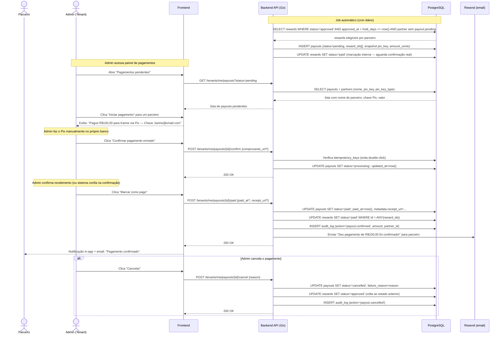

# Indica AÍ! — Pagamentos & Compliance (v1.0)

> Documento produzido por @payments-chief | 2026-05-13 — revisado 2026-05-13 (modelo de pagamento: manual MVP)  
> Dependências lidas: `docs/product-spec.md`, `docs/db-schema.md`, `docs/lgpd-data-policy.md`, `db/migrations/0004_rewards_and_payouts.up.sql`  
> Consumidores: `@backend-chief` (implementação), `@frontend-chief` (UI de extrato/saque), `@security-chief` (KYC e fraude)  
> ⚠️ Seções marcadas requerem validação jurídica antes do go-live. Nenhuma afirmação constitui aconselhamento jurídico.

---

## 1. ESTRATÉGIA DE GATEWAYS

### 1.1 Decisão MVP: Pagamento manual com registro — sem gateway integrado

**O Indica AÍ! não movimenta dinheiro no MVP.** A empresa-tenant paga seus próprios parceiros pelo canal que preferir (Pix manual, transferência, dinheiro) e confirma o pagamento no painel da plataforma.

**Por que esta decisão:**

| Razão | Detalhe |
|-------|---------|
| **Risco regulatório eliminado** | Se o Indica AÍ! movimentasse dinheiro de terceiros (tenant → parceiro), poderia ser enquadrado como **Instituição de Pagamento** pelo BACEN, exigindo autorização regulatória. Pagamento manual: risco zero. |
| **Questão de conta por tenant** | Cada tenant teria que criar e conectar sua própria conta Asaas. Isso adiciona fricção de onboarding considerável no MVP. |
| **Adequado ao nicho-alvo** | Óticas, clínicas, academias — negócios locais já pagam fornecedores via Pix do celular. Confirmar no sistema é natural para eles. |
| **Time-to-market** | Sem integração bancária, o backend de pagamentos é implementado em dias, não semanas. |

**O que a plataforma faz no MVP:**
1. Calcula e registra as recompensas devidas.
2. Exibe extrato claro para o tenant: quem recebe, quanto, chave Pix.
3. Admin do tenant faz o Pix manualmente no próprio banco.
4. Admin clica **"Confirmar pagamento"** no painel + informa comprovante (opcional).
5. Sistema registra `paid_at`, notifica parceiro, fecha o ciclo.

---

### 1.2 Estratégia por tipo de recompensa

| Tipo de recompensa | Gateway necessário? | Mecanismo MVP | Fase 2 |
|--------------------|--------------------|-----------|----|
| `commission_fixed` / `commission_pct` (Pix) | **Não** | Tenant paga manualmente; confirma no painel | Gateway automático |
| `flexible_split` — parte comissão (Pix) | **Não** | Idem; exibir valor split no extrato | Gateway automático |
| `flexible_split` — parte desconto | **Não** | Cupom gerado internamente; entregue por email/painel | — |
| `cashback` / `credit` interno | **Não** | Saldo em wallet interna; tenant confirma resgate | — |
| `goal_based` físico (ex: óculos) | **Não** | Notificação ao tenant; entrega off-system | — |
| `points` | **Não** | Sistema de pontos interno | — |
| `recurring_commission` | **Não** | Agendamento via cron gera rewards; tenant confirma pagamento | Gateway automático |

**Voucher/cupom de desconto:**
- Gerado internamente: UUID curto + HMAC para validação.
- Entregue via email (Resend) ou exibido no painel do parceiro para repassar ao lead.
- Validação: widget JS verifica código via `GET /api/coupons/:code`.

---

### 1.3 Roadmap de gateway — Fase 2

Quando o tenant atingir volume suficiente para justificar automação:

**Modelo recomendado para Fase 2: cada tenant conecta sua própria conta Asaas.**

```
Tenant configura no painel → "Conectar conta Asaas"
    → Informa API Key da sua conta Asaas
    → Indica AÍ! armazena criptografada em tenants.settings
    → PayoutWorker usa a key do tenant ao disparar pagamentos
    → Dinheiro sai da conta bancária do próprio tenant
    → Indica AÍ! nunca toca no dinheiro → zero risco regulatório
```

O Indica AÍ! continua sem ser IP (Instituição de Pagamento). O DB já está preparado: `payouts.external_id` recebe o ID Asaas quando essa feature for ligada.

**Comparativo de gateways para Fase 2 (referência):**

| Gateway | Taxa Pix envio | API Go | KYC parceiro | Observação |
|---------|---------------|--------|-------------|-----------|
| **Asaas** | ~R$1,99/tx | REST limpo | Simples (chave Pix) | Referência atual no codebase |
| **Stark Bank** | ~R$0,60–1,20/tx | SDK Go oficial | Mais rígido | Melhor para alto volume |
| **Efí (Gerencianet)** | ~R$0,99/tx | REST bom | Simples | Boa alternativa nacional |
| **Mercado Pago** | ~R$1,99/tx | REST verboso | Simples | Alta penetração no nicho local |

**Decisão da Fase 2:** Asaas ou Stark Bank, dependendo do volume médio por tenant. Definir interface `PixGateway` no Go antes de implementar, para trocar sem impacto no restante do código.

---

## 2. FLUXO DE SAQUE DO PARCEIRO

### 2.1 Máquina de estados dos payouts (MVP — pagamento manual)

```
rewards (N) aprovadas pelo tenant
         │
         ▼
   PAYOUT criado automaticamente
   status: pending
   (parceiro vê "disponível para saque")
         │
   [Admin do tenant revisa extrato no painel]
         │
         ▼
   status: processing ← Admin clicou "Confirmar pagamento"
   (sistema exibe chave Pix + valor para o admin fazer o Pix manualmente)
         │
    ┌────┴───────────────────────────────┐
    │                                    │
    ▼                                    ▼
  PAID                               CANCELLED
  Admin confirmou pagamento          Admin cancelou
  (informa comprovante opcional)     (reward volta para approved/disponível)
  status: paid, paid_at = now()
```

**Estados do `payouts.status` no MVP:**

| Estado | Quem seta | Condição |
|--------|-----------|----------|
| `pending` | Sistema | Payout criado; aguarda ação do tenant |
| `processing` | Admin tenant | Admin iniciou o pagamento manual |
| `paid` | Admin tenant | Admin confirmou que o Pix foi feito |
| `cancelled` | Admin tenant | Pagamento cancelado (ex: parceiro saiu do programa) |
| `failed` | (não usado no MVP) | Reservado para integração gateway na Fase 2 |

> **Nota ao @backend-chief:** O estado `approved` não é necessário no fluxo manual — a aprovação da *reward* já existe na tabela `rewards`. O payout é criado já em `pending` e vai direto para `processing` quando o admin confirma. A migration 0004 cobre os estados necessários para o MVP sem alteração.

---

### 2.2 Quando criar o payout

**O sistema cria o payout automaticamente quando:**
- `rewards.status = 'approved'` AND
- `rewards.approved_at + hold_days <= now()` (hold expirado) AND
- `partners.pix_key IS NOT NULL` (KYC mínimo ok)

**Configurado em `programs.settings`:**

```json
{
  "payout_min_cents": 5000,   // R$50,00 — não agrupa rewards menores que isso
  "hold_days": 7              // dias após aprovação da reward antes de liberar
}
```

**Agrupamento:** rewards aprovadas e com hold expirado para o mesmo parceiro são agrupadas em um único payout (array `reward_ids[]`). Simplifica o extrato do tenant.

**Hold period anti-fraude:**
- Default 7 dias: reward aprovada hoje → payout elegível daqui 7 dias.
- Configurável por programa (mínimo recomendado: 3 dias).

---

### 2.3 Limites

| Parâmetro | MVP default | Configurável por tenant? |
|-----------|-------------|--------------------------|
| Valor mínimo por payout | R$50,00 (5.000 cents) | Sim |
| Hold period | 7 dias | Sim (por programa) |
| Pagamentos por dia por parceiro | Sem limite | — |
| Payouts simultâneos com status `pending` | 1 por parceiro | Não (evita duplicata) |

---

### 2.4 KYC do parceiro — dados Pix

**Dados obrigatórios para habilitar saque:**

| Campo | Onde armazenado | Obrigatório? | Validação |
|-------|----------------|-------------|-----------|
| CPF/CNPJ | `partners.document` | **Sim** | Dígitos verificadores na app layer |
| Chave Pix | `partners.pix_key` | **Sim** | Formato validado na app layer (sem consulta ao gateway no MVP) |
| Tipo da chave | `partners.pix_key_type` | **Sim** | `cpf`, `cnpj`, `email`, `phone`, `random` |
| Nome completo | `partners.name` | **Sim** | Free text, mínimo 3 caracteres |

**Validação da chave Pix no MVP:**
1. Parceiro informa a chave no painel.
2. Backend valida o **formato** localmente (regex por tipo: CPF = 11 dígitos, email = RFC 5322, telefone = E.164, random = 32 chars hex).
3. Exibir aviso: *"Verifique a chave antes de pagar. O sistema não valida junto ao Banco Central no plano atual."*
4. Salvar `pix_key` + `pix_key_type`. Snapshot copiado em `payouts.pix_key` no momento da criação do payout.

> **Fase 2:** com gateway conectado, adicionar validação via `GET /v3/pix/addressKeys/{key}` na API Asaas e exibir o nome do titular para confirmação.

**Armazenamento e criptografia:**
- `partners.pix_key` é PII financeira (retention 5y).
- Criptografia at-rest via TDE do provider (Fly.io/Neon).
- Nunca logar `pix_key` em texto puro — mascarar nos logs: `****` + últimos 4 chars.

**Conformidade LGPD:**
- Retenção: 5 anos após último payout confirmado com obrigação fiscal.
- Direito de exclusão: bloqueado enquanto houver payout com obrigação fiscal pendente.
- Snapshot em `payouts.pix_key`: **não anonimizar** enquanto houver nota fiscal associada.

---

### 2.5 Idempotência

Sem gateway no MVP, o risco de duplicação é menor, mas ainda existe (double-click, retry de request). Usar a tabela `idempotency_keys` já existente para o endpoint de confirmação de pagamento:

```
Idempotency-Key: confirm-payout-{payout_id}
TTL: 24h
```

Se o admin clicar duas vezes em "Confirmar pagamento", o segundo request retorna o mesmo `200 OK` sem criar duplicata.

---

## 3. DIAGRAMA MERMAID — FLUXO DE SAQUE (MVP — pagamento manual)



---

## 4. WALLET DO PARCEIRO

### 4.1 Modelo contábil

```
Saldo Disponível   = SUM(rewards.amount_cents WHERE status='approved' AND hold_expirado)
                   - SUM(payouts.amount_cents WHERE status IN ('pending','approved','processing','paid'))

Saldo Em Hold      = SUM(rewards.amount_cents WHERE status='approved' AND hold_nao_expirado)

Saldo Pendente     = SUM(rewards.amount_cents WHERE status='pending')
                     (aguarda aprovação da empresa-tenant)

Saldo Bloqueado    = SUM(rewards.amount_cents WHERE status IN ('pending') AND fraud_flag=true)
                     (via sistema anti-fraude — Fase 2)

Total Pago         = SUM(payouts.amount_cents WHERE status='paid')

Hold expirado: rewards.approved_at + programs.settings.hold_days <= now()
```

### 4.2 Event sourcing vs. saldo materializado

**Decisão: derivar das tabelas no MVP; materializar em Fase 2.**

**Fundamentos:**

| Abordagem | Prós | Contras |
|-----------|------|---------|
| **Event sourcing** (derivar de rewards + payouts) | Zero risco de inconsistência, sem código de sync | Query pode ser lenta com muitos registros |
| **Saldo materializado** (coluna `available_cents` em `partners`) | Leituras O(1) | Risco de drift se update falhar; complexity de sync |

Para o MVP, o volume por parceiro é baixo (< 1.000 rewards). Uma query bem indexada é suficiente:

```sql
-- Saldo disponível para saque (hold expirado, rewards aprovadas, menos payouts não-paid)
SELECT
    COALESCE(SUM(r.amount_cents), 0)
        FILTER (WHERE r.status = 'approved'
                  AND r.approved_at + (p.settings->>'hold_days')::int * INTERVAL '1 day' <= now())
  - COALESCE(SUM(py.amount_cents), 0)
        FILTER (WHERE py.status IN ('pending', 'approved', 'processing', 'paid'))
    AS available_cents,
    COALESCE(SUM(r.amount_cents), 0)
        FILTER (WHERE r.status = 'approved'
                  AND r.approved_at + (p.settings->>'hold_days')::int * INTERVAL '1 day' > now())
    AS hold_cents,
    COALESCE(SUM(r.amount_cents), 0)
        FILTER (WHERE r.status = 'pending')
    AS pending_cents,
    COALESCE(SUM(py.amount_cents), 0)
        FILTER (WHERE py.status = 'paid')
    AS total_paid_cents
FROM partners pa
JOIN programs p ON p.id = pa.program_id
LEFT JOIN rewards r ON r.partner_id = pa.id AND r.tenant_id = pa.tenant_id
LEFT JOIN payouts py ON py.partner_id = pa.id AND py.tenant_id = pa.tenant_id
WHERE pa.id = $1 AND pa.tenant_id = $2;
```

**Índices que viabilizam a query (já existem):**
- `rewards(partner_id)` — `rewards_partner_idx`
- `rewards(tenant_id, status)` — `rewards_status_idx`
- `payouts(partner_id)` — `payouts_partner_idx`

**Quando materializar (Fase 2):**
- > 10.000 rewards por parceiro, ou
- P95 da query de wallet > 200ms no dashboard.
- Criar `materialized view partner_wallet_summary` com `REFRESH CONCURRENTLY` a cada 5min.

---

### 4.3 Reconciliação periódica

**Job `WalletReconciliationJob` — execução semanal:**

1. Para cada payout com `status = 'paid'`:
   - Buscar status real no Asaas via `GET /v3/payments/{external_id}`.
   - Se Asaas diz `CONFIRMED` → OK.
   - Se Asaas diz status diferente → alertar SaaS admin + logar `audit_log(action='payout.reconciliation_mismatch')`.
2. Para cada payout com `status = 'processing'` e `updated_at < now() - 2h`:
   - Considerar possível "lost update" (worker caiu após chamada Asaas).
   - Consultar Asaas via `externalReference = payout_id`.
   - Atualizar status conforme resposta real.
3. Gerar relatório de reconciliação em `audit_log`.

---

## 5. COMPLIANCE LGPD — REVISÃO ESPECÍFICA PARA PAGAMENTOS

> Esta seção complementa `docs/lgpd-data-policy.md`. Não duplicar lá — referenciar este doc onde necessário.

### 5.1 Consentimento explícito do indicado

**Quando salvar dados do lead:**

O lead pode chegar de duas formas:
1. **Formulário com política visível** → exibir checkbox "Aceito os termos de uso e política de privacidade" + salvar `consents` antes do `INSERT` em `leads`.
2. **WhatsApp manual** → atendente cadastra o lead no painel. Neste caso:
   - A empresa-tenant é a **controladora** dos dados do lead.
   - O Indica AÍ! é **operador**.
   - O DPA (Data Processing Agreement) com o tenant deve exigir que o atendente confirme que o lead foi informado.
   - Na UI, exibir: *"Confirmo que o lead foi informado sobre o uso dos seus dados conforme nossa política de privacidade."*
   - Salvar esse "consent by proxy" em `consents` com `acceptance_method = 'admin_confirmed'`.

**Fluxo técnico:**

```
[Formulário web com referral_code]
    → GET /api/programs/{slug}/consent-text  (retorna policy_version + texto)
    → Usuário aceita checkbox
    → POST /api/leads + body inclui consent: { policy_version, accepted: true }
    → Backend:
        1. INSERT consents (user_type='lead', visitor_id, policy_version, scopes=['operational'])
        2. INSERT leads (referral_id, ...)
    → ambas em transação — ou nenhuma ocorre
```

### 5.2 Direito de exclusão sem quebrar histórico contábil

**Regra fundamental:** anonimizar PII, preservar agregados financeiros.

| Dado | Ação ao receber erasure request |
|------|--------------------------------|
| `leads.name`, `phone_e164`, `email` | NULL / hash anônimo — ver `lgpd-data-policy.md §5.4` |
| `partners.name`, `email`, `phone_e164`, `document` | Anonimizar — ver `lgpd-data-policy.md §5.2` |
| `partners.pix_key` | **Só anonimizar após 5 anos do último payout confirmado** (obrigação fiscal) |
| `payouts.pix_key` (snapshot) | **Nunca anonimizar se houver nota fiscal emitida** (Lei 9.430/96) |
| `payouts.amount_cents`, `paid_at`, `status` | **Nunca alterar** — registro fiscal imutável |
| `rewards.amount_cents`, `approved_at` | **Nunca alterar** — base do cálculo fiscal |
| `consents` | **Nunca deletar** — manter para prova de conformidade |
| `audit_log` | **Nunca deletar** — apenas anonimizar `actor_ip` após 2 anos |

**Pseudocódigo para validação antes de anonimizar `pix_key`:**

```go
func canAnonimizePIXKey(partnerID uuid.UUID) bool {
    lastFiscalPayout := db.QueryRow(`
        SELECT MAX(paid_at) FROM payouts
        WHERE partner_id = $1 AND status = 'paid' AND metadata->>'has_fiscal_doc' = 'true'
    `, partnerID)
    if lastFiscalPayout == nil {
        return true  // sem obrigação fiscal, pode anonimizar
    }
    return time.Since(lastFiscalPayout) > 5*365*24*time.Hour
}
```

### 5.3 Direito de portabilidade — dados financeiros

O export de portabilidade (já definido em `lgpd-data-policy.md §4.2.5`) deve incluir:

```json
{
  "rewards": [
    {
      "type": "commission_fixed",
      "amount_brl": "100.00",
      "status": "paid",
      "program_name": "Indicação Ótica",
      "referral_date": "2026-03-15",
      "approved_at": "2026-03-22",
      "paid_at": "2026-03-29"
    }
  ],
  "payouts": [
    {
      "amount_brl": "100.00",
      "method": "pix",
      "pix_key_type": "cpf",
      "pix_key_masked": "***.***.123-**",
      "status": "paid",
      "paid_at": "2026-03-29"
    }
  ],
  "total_received_brl": "100.00"
}
```

**Nota:** `pix_key` deve ser mascarada no export de portabilidade (o dado já é do titular, mas evitar exposição completa em arquivo downloadável).

### 5.4 Base legal por tipo de dado financeiro

| Dado | Base legal primária | Base legal alternativa | Obs. |
|------|--------------------|-----------------------|------|
| CPF do parceiro | `CONTRATO` (art. 7º, V) | `LEGAL` se há emissão de NF | Essencial para pagar e emitir informes |
| Chave Pix | `CONTRATO` (art. 7º, V) | — | Execução do contrato de parceria |
| Histórico de payouts | `LEGAL` (art. 7º, II) — Lei 9.430/96 | — | Obrigação fiscal; 5 anos mínimo |
| `rewards.amount_cents` | `CONTRATO` | `LEGAL` | Registro do compromisso financeiro assumido |
| `consents.ip_address` | `LEGAL` (art. 37 LGPD) | — | Prova de conformidade |

### 5.5 Prazos de retenção (resumo específico de pagamentos)

| Dado | Prazo | Base legal |
|------|-------|-----------|
| `payouts` com NF emitida — todos os campos | 5 anos mínimo | Lei 9.430/96 |
| `payouts` sem NF / cancelados — `pix_key` | 2 anos | Minimização LGPD |
| `partners.pix_key` / `document` | 5 anos após último payout confirmado | Lei 9.430/96 |
| `rewards` (todos os campos) | 5 anos | Fiscal + LGPD |
| `consents` (todos) | 5–10 anos | LGPD art. 37 |

---

## 6. CONTRATOS

### 6.1 Termos de Uso da Empresa-Cliente (SaaS Agreement)

**Escopo:** Contrato entre Indica AÍ! (operador/fornecedor) e a empresa que contrata o SaaS (controladora/cliente).

**Cláusulas obrigatórias:**

| Cláusula | Conteúdo essencial |
|----------|-------------------|
| Objeto | Uso da plataforma para gestão de programas de indicação |
| Responsabilidade pelo programa | Empresa-cliente é responsável pela legalidade das regras do programa |
| DPA (Data Processing Agreement) | Indica AÍ! processa dados de leads e parceiros apenas por instrução do cliente; cliente é controladora |
| Subprocessadores | Lista: Asaas (pagamentos), Cloudflare (CDN/workers), Vercel (frontend), Fly.io/Neon (banco), Resend (email) |
| Responsabilidade fiscal | Empresa-cliente é responsável pelo recolhimento de tributos sobre comissões pagas aos parceiros |
| Uso aceitável | Proibição de programas de pirâmide, MLM ilegal, conteúdo proibido |
| SLA | Uptime, janelas de manutenção |
| Limitação de responsabilidade | Valor limitado a 3 meses de mensalidade paga |
| Rescisão e portabilidade de dados | Exportação de dados em até 30 dias após rescisão; exclusão após 90 dias |
| Notificação de incidentes | Comunicar em até 72h conforme LGPD art. 48 |

⚠️ **Jurídico:** Redigir DPA separado ou como anexo ao ToS. O DPA deve cobrir art. 7º, 15, 16 e 37 da LGPD.

---

### 6.2 Termo de Adesão do Parceiro/Indicador

**Escopo:** Contrato entre o parceiro (indicador) e a empresa-tenant que o cadastra no programa.

> O Indica AÍ! fornece o template; a empresa-tenant personaliza com seus dados.

**Cláusulas obrigatórias:**

| Cláusula | Conteúdo |
|----------|----------|
| Identificação das partes | Empresa X e parceiro Y, CPF/CNPJ |
| Objeto do programa | Descrição do programa, tipo de recompensa, meta/valor |
| Condições de elegibilidade | Requisitos para receber comissão (ex: venda confirmada, sem auto-referral) |
| **Responsabilidade fiscal do parceiro** | *"As comissões recebidas constituem rendimento tributável. O parceiro é responsável por declará-las ao fisco, inclusive no IRPF (se PF) ou emitir Nota Fiscal (se PJ). A empresa não realiza retenção de IR na fonte exceto quando obrigada por lei."* |
| **IR e obrigações tributárias** | Mapeamento da seção §8 deste documento; ⚠️ validar com jurídico tributário |
| Dados pessoais e LGPD | Finalidade do uso do CPF e chave Pix; base legal CONTRATO; direitos do titular |
| Declaração de maioridade | "Declaro ter 18 anos ou mais" |
| Proibições | Auto-referral, fraude, spam, uso indevido do link |
| Vigência | Enquanto o programa estiver ativo; rescisão com 30 dias de aviso |
| Pagamento de comissões | Prazo, método (Pix), hold period, valor mínimo |
| Cancelamento de comissão | Em caso de chargeback, fraude confirmada, cancelamento da venda dentro de X dias |

**Implementação técnica:**
- Parceiro assina digitalmente ao aceitar o convite via painel ou link de cadastro.
- Salvar `consents` com `policy_name = 'partner_agreement'`, `policy_version`, `acceptance_method = 'digital_signature'`.
- Guardar timestamp, IP e user-agent como prova.

---

### 6.3 Política de Privacidade do Indicado (Lead)

**Escopo:** Comunicação ao lead sobre o uso dos seus dados quando se cadastra via formulário de indicação.

**Elementos obrigatórios (LGPD art. 9):**

| Elemento | Conteúdo |
|----------|----------|
| Identificação do controlador | Empresa X (CNPJ, endereço, email) — *não* o Indica AÍ! |
| Finalidade | "Registro de indicação, contato comercial, rastreamento de conversão" |
| Dados coletados | Nome, telefone, email |
| Base legal | Execução de contrato preliminar (art. 7º, V) + legítimo interesse anti-fraude (art. 7º, IX) |
| Compartilhamento | Dados processados pela plataforma Indica AÍ! como operadora; não vendidos a terceiros |
| Retenção | 2 anos se sem venda; 5 anos se venda confirmada |
| Direitos do titular | Acesso, correção, anonimização, eliminação, portabilidade — via `[link_para_pagina_meus_dados]` |
| Canal do DPO | `privacidade@[empresa].com.br` |
| Cookie | Se o lead clicou num link rastreado: explicar o `_iaref` (ver `lgpd-data-policy.md §7`) |

**Implementação:**
- Template white-label fornecido pelo Indica AÍ!; empresa-tenant personaliza com seus dados.
- Versão hospedada em `/privacidade` do tenant (`{empresa}.indica.ai/privacidade`).
- Exibir link obrigatório no rodapé de qualquer formulário de captura de lead.

---

## 7. TRIBUTÁRIO — MAPEAMENTO DE COMPLEXIDADE

> Esta seção mapeia o problema; a **implementação fica em backlog**. Validação jurídica obrigatória antes de qualquer decisão definitiva.

### 7.1 Cenários por perfil do parceiro

| Perfil | Regime tributário | Obrigação sobre comissões recebidas |
|--------|------------------|-------------------------------------|
| **PF — comissões ocasionais** | IRPF | Rendimento "outros" — declarar na DAA anual. IR não retido na fonte pela empresa pagadora em geral. |
| **PF — comissões regulares / habituais** | Pode ser caracterizado como trabalho | Risco de vínculo empregatício ou "trabalho sem vínculo" (INSS + IR). ⚠️ Consultar jurídico. |
| **PJ (MEI)** | Simples Nacional | MEI não pode emitir NF para serviços que não constam no CNAE. Risco de desenquadramento. |
| **PJ (ME/EPP)** | Simples, Lucro Presumido, Real | Deve emitir NF de serviço; empresa pagadora pode ter obrigação de reter ISS. |

### 7.2 Informe de rendimentos

**Trigger potencial:** parceiro PF recebeu comissões no ano.

- A obrigação de fornecer informe de rendimentos existe para fontes pagadoras que realizam pagamentos sujeitos à retenção na fonte.
- Para comissões pagas via Pix sem retenção, não há obrigação legal clara de emitir informe — mas é **boa prática** e reduz risco do parceiro com a Receita Federal.
- **Recomendação para Fase 2:** gerar informe de rendimentos anual por parceiro (total pago no ano, método, CNPJ da empresa pagadora).
- Threshold de atenção: parceiros PF que receberam > R$28.559,70/ano (faixa de isenção IRPF 2026 — ⚠️ verificar tabela vigente).

### 7.3 IR retido na fonte (IRRF)

- IRRF sobre "comissões" pagas por PJ a PF é previsto no Regulamento do IR, mas há discussão sobre quando se aplica a programas de indicação.
- Para o MVP: **não reter** na fonte, informar parceiro sobre obrigação de declarar.
- Cláusula no Termo de Adesão (§6.2) cobre a responsabilidade do parceiro.
- ⚠️ Obter parecer jurídico-tributário antes de escalar o volume para R$1M+/mês em comissões PF.

### 7.4 Tickets de backlog — tributário

| # | Título | Prioridade |
|---|--------|-----------|
| TAX-01 | Contratar assessoria jurídico-tributária para parecer sobre IRRF em comissões de indicação | 🔴 Antes do go-live |
| TAX-02 | Implementar gerador de informe de rendimentos anual por parceiro (PDF + CSV) | 🟡 Fase 2 |
| TAX-03 | Campo `fiscal_doc_ref` em `payouts` para referência de NF emitida por parceiro PJ | 🟡 Fase 2 |
| TAX-04 | Alertar empresa-tenant quando parceiro PF ultrapassar R$28k no ano | 🟢 Fase 3 |

---

## 8. LISTA PRIORIZADA DE TICKETS PARA @BACKEND-CHIEF

> Ordenados por criticidade para go-live. Modelo MVP = pagamento manual; gateway automático é Fase 2.

### 🔴 Crítico — Bloqueante para MVP

| # | Título | Descrição resumida | Estimativa |
|---|--------|-------------------|-----------|
| PAY-01 | Job `CreatePayoutsJob` (cron diário) | Agrupa rewards `approved` com hold expirado por parceiro → INSERT payouts (`pending`). Valida pix_key presente. Idempotência: não criar se já existe payout `pending` para o mesmo parceiro. | 1d |
| PAY-02 | Endpoint `GET /tenants/me/payouts` — fila de pagamentos | Listagem paginada para admin com filtro de status. Retornar nome, pix_key, pix_key_type, amount_cents por payout. | 4h |
| PAY-03 | Endpoint `POST /tenants/me/payouts/{id}/confirm` | Marca `processing`. Idempotência via `idempotency_keys`. Registra `audit_log`. | 4h |
| PAY-04 | Endpoint `POST /tenants/me/payouts/{id}/paid` | Marca `paid`, `paid_at`, optional `receipt_url`. Atualiza `rewards.status = 'paid'`. Notifica parceiro via Resend. `audit_log`. | 4h |
| PAY-05 | Endpoint `POST /tenants/me/payouts/{id}/cancel` | Marca `cancelled`. Reverte rewards para `approved`. `audit_log`. | 2h |
| PAY-06 | Endpoint `GET /partners/me/wallet` | Derivar saldo disponível, hold, pendente, total pago via query SQL (§4.2). | 4h |
| PAY-07 | Endpoint `GET /partners/me/payouts` (histórico do parceiro) | Listagem paginada de payouts com status, valor, data. | 3h |
| PAY-08 | Endpoint `PATCH /partners/me/pix-key` | Salvar/atualizar `partners.pix_key` com validação de formato local (regex por tipo). | 3h |

### 🟡 Importante — MVP completo

| # | Título | Descrição resumida | Estimativa |
|---|--------|-------------------|-----------|
| PAY-09 | Consentimento do lead antes de INSERT | Refatorar `POST /leads` para receber `consent: { policy_version, accepted }` e inserir em `consents` na mesma transação. | 4h |
| PAY-10 | Geração de cupom de desconto (`flexible_split`) | Quando `split_choice.discount_cents > 0`, criar cupom (UUID short + HMAC), salvar em `payouts.method='coupon'`, enviar via Resend ao lead. | 6h |
| PAY-11 | Notificação email ao parceiro — payout confirmado | Email transacional via Resend quando `status → paid`. Template: "Seu pagamento de R$X foi confirmado". | 3h |
| PAY-12 | Notificação email ao admin — rewards prontas para pagar | Email/in-app diário quando há payouts `pending` há mais de 1 dia sem ação. | 3h |
| PAY-13 | UI de extrato/saque do parceiro (Frontend) | Tela de wallet com saldo disponível, histórico de payouts, chave Pix. Já prevista nos wireframes. | delegar ao @frontend-chief |

### 🟢 Pós-MVP / Fase 2

| # | Título | Descrição resumida |
|---|--------|--------------------|
| PAY-14 | Integração Asaas por tenant (conta própria do tenant) | Tenant configura API Key Asaas no painel; `CreatePayoutsJob` dispara Pix automaticamente. |
| PAY-15 | Interface `PixGateway` em Go + `AsaasGateway` | Preparar abstração antes de codificar a integração. |
| PAY-16 | Webhook handler Asaas (`PAYMENT_CONFIRMED`, `PAYMENT_REPROVED`) | Atualizar status automaticamente após disparo pelo gateway. |
| PAY-17 | `RetryPayoutJob` — retry automático em falha de gateway | Backoff exponencial para falhas de envio ao Asaas. |
| PAY-18 | `WalletReconciliationJob` (semanal) | Reconciliar payouts `processing` contra status real no Asaas. |
| PAY-19 | Materialized view `partner_wallet_summary` | Refresh CONCURRENTLY a cada 5min quando volume de rewards/parceiro escalar. |
| PAY-20 | Criptografia da `pix_key` na app layer (AES-256-GCM) | Chave derivada de tenant_id + secret env. |
| PAY-21 | Informe de rendimentos anual por parceiro (PDF) | Total recebido no ano, método, CNPJ da empresa. |

---

## 9. CHECKLIST DE GO-LIVE — PAGAMENTOS & COMPLIANCE

### Técnico
- [ ] `CreatePayoutsJob` rodando em cron diário em staging
- [ ] Endpoints PAY-01 a PAY-08 implementados e testados
- [ ] Idempotência testada: double-click em "Confirmar" não cria duplicata
- [ ] Validação de formato de chave Pix funcionando (regex local)
- [ ] `payouts.pix_key` é snapshot — confirmar que usa valor no momento de criação do payout, não o atual do parceiro
- [ ] Logs mascarando `pix_key` (apenas últimos 4 chars)
- [ ] Notificação email ao parceiro funcionando via Resend quando `paid`
- [ ] Cancelamento de payout reverte rewards para `approved` corretamente
- [ ] `audit_log` registrado em todos os eventos de payout (confirmed, paid, cancelled)

### Compliance LGPD
- [ ] Consentimento do lead coletado antes de INSERT em `leads` (formulário web)
- [ ] "Consent by proxy" implementado na UI de cadastro manual de lead
- [ ] Direito de erasure bloqueado quando `payouts` com `fiscal_doc_ref` pendente
- [ ] Export de portabilidade inclui `rewards` e `payouts` com `pix_key` mascarada
- [ ] DPA assinado com Asaas (já listado em `lgpd-data-policy.md Apêndice B`)

### Contratos
- [ ] Template de Termo de Adesão do Parceiro redigido e revisado por jurídico
- [ ] Cláusula fiscal no Termo de Adesão (responsabilidade IRPF do parceiro PF)
- [ ] Declaração de maioridade implementada no cadastro de parceiro
- [ ] Política de Privacidade white-label disponível em `{tenant}.indica.ai/privacidade`
- [ ] DPA no contrato de SaaS com empresas-cliente redigido com jurídico

---

*Versão 1.0 — @payments-chief — 2026-05-13*  
*Próxima revisão: antes de integrar segundo gateway ou escalar volume > R$500k/mês em comissões.*
