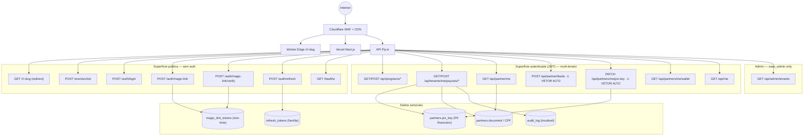

# Indica AÍ! — Segurança & Anti-Fraude (v1.0)

> Documento produzido por @security-chief | 2026-05-13  
> Dependências lidas: `docs/product-spec.md`, `docs/architecture.md`, `docs/db-schema.md`,
> `docs/lgpd-data-policy.md`, `docs/payments-compliance.md`, `internal/api/middleware/`,
> `internal/platform/auth/jwt.go`, `internal/api/handlers/`, `internal/workers/attribution/`,
> `db/migrations/0006`, `0007`, `0008`  
> Consumidores: `@backend-chief` (tickets SEC-XX), `@qa-chief` (pen-test checklist)

---

## Resumo Executivo

O Indica AÍ! expõe dinheiro real em cada flow: clique → lead → venda → payout Pix.
Cinco decisões estruturais definem a postura de segurança do MVP:

1. **RLS é a segunda barreira, não a única.** Toda query de domínio deve rodar dentro de `BeginTenant()` — `pool.Begin()` direto bypassa o RLS e já ocorre em produção (SEC-01, crítico).
2. **Magic link não pode entregar token no body em produção.** Hoje retorna `dev_token` incondicionalmente; qualquer chamada à API obtém sessão válida sem acesso ao e-mail (SEC-02, crítico).
3. **API Key auth é stub.** `AuthAPIKey()` aceita qualquer string — endpoints de integração não têm autenticação real (SEC-03, crítico).
4. **Rate limit falha aberto.** Se Redis cair, todas as rotas ficam sem limite — click farms e brute-force passam livremente (SEC-04, alto).
5. **Headers de segurança HTTP estão ausentes.** Nenhum CSP, HSTS, X-Frame-Options ou X-Content-Type-Options no router base (SEC-05, alto).

Rule-based engine no MVP: determinístico, auditável, implementável em 1 sprint. ML entra somente quando houver volume > 10k indicações/mês para treinar. Seis sinais são computáveis com o schema atual; nenhum sinal inventado.

---

## 1. Threat Model (STRIDE simplificado)

### 1.1 Atores

| Ator | Perfil de ameaça |
|------|-----------------|
| **Parceiro malicioso** | Tem acesso legítimo à API autenticada; quer maximizar comissões fraudulentamente |
| **Admin malicioso do tenant** | Acesso a dados de todos os parceiros do seu tenant; pode manipular aprovações de reward |
| **Atacante externo** | Sem credenciais; ataca superfície pública (tracking, auth, scraping) |
| **Insider (saas_admin)** | Bypass total de RLS; acesso a dados de todos os tenants |

### 1.2 Top-5 ameaças por ator

#### Parceiro malicioso

| Ameaça | Impacto | STRIDE |
|--------|---------|--------|
| **Auto-referral**: cadastra lead com phone/email próprio ou de familiar | Reward indevida: valor da comissão | Spoofing |
| **Lead farming**: insere leads com telefones reais de desconhecidos esperando conversão casual | Reward indevida; viola LGPD do lead | Elevation of Privilege |
| **Atribuição roubada**: insere lead manual após parceiro B já gerou click, sobrescreve atribuição | Rouba comissão de parceiro legítimo | Tampering |
| **Wash trade**: combina com cliente do tenant, compra+cancela após payout | Payout indevido; se payout já foi Pix, dinheiro perdido | Elevation of Privilege |
| **PIX key swap**: toma conta via magic-link interceptado, troca pix_key antes do próximo payout | Redireciona pagamentos para conta do atacante | Spoofing |

#### Admin malicioso do tenant

| Ameaça | Impacto |
|--------|---------|
| Aprova manualmente rewards fraudulentas de parceiro cúmplice | Drena budget do programa |
| Acessa dados PII de todos os parceiros/leads sem justificativa | Violação LGPD |
| Cancela payouts de parceiros legítimos sem motivo | Litígio; churn |
| Cria parceiros falsos com pix_key própria | Comissões para conta própria |
| Manipula `amount_cents` em `sales` (se houver endpoint de update) | Aumenta base de cálculo de comissão |

#### Atacante externo

| Ameaça | Impacto |
|--------|---------|
| Brute-force de magic-link: itera tokens de 32 bytes | Improvável matematicamente, mas endpoint exposto sem rate limit |
| Enumeração de slugs via GET /r/:slug | Mapeia parceiros do tenant |
| Scraping de `GET /api/partner/me` de todos os parceiros | Coleta PII; análise competitiva |
| Injeção em campos JSONB de rules/split_choice | RCE se engine interpretar código; DoS se schema não validado |
| Click farm via POST /events/click sem auth nem rate limit | Distorce métricas; pode ativar rewards por clique se regra existir |

#### Insider (saas_admin)

| Ameaça | Impacto |
|--------|---------|
| Leitura de PII de todos os tenants sem audit trail | Violação LGPD crítica |
| Aprovação manual de rewards cross-tenant | Dano financeiro |
| Exportação de dump de `partners` (pix_key, CPF) | Vazamento de dados financeiros |
| Modificação de `programs.rules` via SQL direto (bypass da app layer) | Altera regras de comissão retroativamente |

### 1.3 Diagrama de superfície de ataque



**Legenda de risco:**
- ⚠ VETOR ALTO = endpoint com impacto financeiro direto
- Superfície pública = qualquer bot pode chamar sem credencial

---

## 2. Anti-fraude — Engine e Sinais

### 2.1 Princípio de design

**Rule-based no MVP.** Sem ML no MVP — não há volume para treinar, e regras determinísticas são auditáveis (LGPD art. 20: decisão automatizada exige explicabilidade). Quando o sistema atingir >10k indicações/mês, introduzir feature store + modelo de anomalia (Isolation Forest ou GBDT leve).

**Onde rodam as checagens:**

| Ponto de checagem | O que roda | Síncrono? |
|-------------------|-----------|-----------|
| `POST /api/partner/leads` (handler) | Self-referral por phone_hash + email_hash | Sim — bloqueia antes do INSERT |
| Job `AttributeReferralJob` (worker) | Score de clique, click farm, fingerprint | Não — score resultante afeta aprovação |
| `POST /tenants/me/payouts/{id}/confirm` | Hold period, wash-trade flag | Sim — bloqueia confirmação |
| Job `CreatePayoutsJob` | Verifica referral.attribution_score threshold | Sim — não cria payout de referral suspeito |

### 2.2 Sinais computáveis (schema atual)

Todos os sinais abaixo são calculáveis com as tabelas existentes. Nenhum sinal novo de coluna exige migration.

| # | Sinal | Tabela(s) | Descrição |
|---|-------|-----------|-----------|
| S1 | **Phone-hash match partner→lead** | `partners`, `leads` | `partners.phone_hash = leads.phone_hash` dentro do mesmo programa |
| S2 | **Email-hash match partner→lead** | `partners`, `leads` | `partners.email_hash = leads.email_hash` |
| S3 | **Document-hash match partner→lead** | `partners` (future) | CPF do parceiro = CPF do lead (quando lead informa CPF) |
| S4 | **Click velocity por IP/24** | `click_events` | > N cliques do mesmo `/24` em janela de 60s |
| S5 | **Unique visitor ratio** | `click_events` | `COUNT(DISTINCT visitor_id) / COUNT(*)` < threshold em janela |
| S6 | **Leads manuais sem click precedente** | `referrals`, `click_events` | `source = 'manual'` AND `attribution_score = 0` (nenhum click_event vinculável) |
| S7 | **Velocidade de lead manual** | `referrals` | > N leads manuais por parceiro em 24h |
| S8 | **Atribuição sobreposta** | `referrals`, `leads` | Lead já tinha referral ativa de outro parceiro dentro da janela de atribuição |
| S9 | **Pix key change pré-payout** | `partners`, `payouts` | `partners.pix_key` trocada < 72h antes de payout pending ser confirmado |

> S3 (document_hash) requer que leads informem CPF — não obrigatório no MVP, incluir quando campo for adicionado.

### 2.3 Modelo de score (0–100)

Score de fraude por referral, calculado no `AttributeReferralJob`:

```
fraud_score = sum(peso_i * sinal_i_ativo)

onde sinal_i_ativo ∈ {0, 1}
```

| Sinal | Peso | Threshold de ativação |
|-------|------|----------------------|
| S1 phone-hash match | 60 | Exato match |
| S2 email-hash match | 50 | Exato match |
| S4 click velocity alta | 25 | > 10 cliques únicos/60s do mesmo /24 |
| S5 low unique ratio | 20 | ratio < 0.15 com totalClicks > 50 |
| S6 manual sem click | 15 | source=manual, score attribution=0 |
| S7 lead manual velocity | 20 | > 5 leads manuais em 24h por parceiro |
| S8 atribuição sobreposta | 30 | outro referral ativo na janela |
| S9 pix key recente | 40 | mudança de pix_key < 72h |

**Thresholds de decisão:**

| Faixa de score | Ação |
|---------------|------|
| 0–19 | Aprovação automática habilitada |
| 20–49 | Flag `suspicious=true` em `referrals.metadata`, requerer revisão manual do admin |
| 50–69 | Bloquear payout automático; notificar admin; manter reward em `pending` |
| ≥ 70 | Rejeitar referral; `attribution_score = 0`; `audit_log` com reason |

**Coluna nova necessária:** `referrals.fraud_score integer DEFAULT 0` e `referrals.suspicious boolean DEFAULT false`. (Ver SEC-07)

### 2.4 Regras específicas por vetor

#### Vetor 1 — Self-referral
- **Sinal:** S1 + S2 (phone ou email match)
- **Onde:** handler `POST /partner/leads` (síncrono) + `AttributeReferralJob` (async)
- **Ação síncrona:** Se `partners.phone_hash = sha256(req.PhoneE164)` → HTTP 422 `self_referral_not_allowed`
- **Ação async:** Score += 60 (S1) ou +50 (S2); se score ≥ 70 → rejeitar

#### Vetor 2 — Click farms
- **Sinal:** S4 + S5
- **Onde:** `AttributeReferralJob` e job periódico `FraudScanJob` (diário)
- **Threshold S4:** > 10 cliques únicos de visitor_ids distintos mas mesmo IP/24 em 60s = click farm
  - Justificativa: dispositivo humano gera 1-3 cliques/sessão; 10+ em 60s de IPs do mesmo /24 = bot
- **Threshold S5:** ratio < 0.15 com base > 50 cliques em 1h
  - Justificativa: usuários reais têm ratio próximo de 1.0 (um clique por visitante); 0.15 significa 85% de cliques repetidos
- **Ação:** Flag `partner.status = 'suspended'` se score ≥ 70 em janela de 24h + audit_log

#### Vetor 3 — Lead farming (POST /partner/leads manual)
- **Sinal:** S6 + S7
- **Onde:** Handler síncrono + `AttributeReferralJob`
- **Rate limit de lead manual:** Max 10 leads manuais por parceiro por 24h (Redis counter)
  - Justificativa: parceiro legítimo indica pessoas que conhece pessoalmente; 10/dia é generoso
- **Score impact:** S6 (+15) + S7 (+20) = 35 → flag suspicious; score ≥ 50 se combinado com S8

#### Vetor 4 — Atribuição roubada
- **Sinal:** S8
- **Onde:** `AttributeReferralJob`
- **Lógica:**
  ```sql
  SELECT r.partner_id FROM referrals r
  JOIN leads l ON l.referral_id = r.id
  WHERE l.phone_hash = $lead_phone_hash
    AND r.program_id = $program_id
    AND r.partner_id != $current_partner_id
    AND r.attributed_at >= now() - INTERVAL '$window_days days'
  ```
- **Ação:** Score += 30; se score ≥ 50 → colocar em revisão manual; o click_event original do parceiro B tem precedência (last_touch respeita o clique mais recente autenticado)

#### Vetor 5 — Wash trades
- **Sinal:** `sales.status = 'refunded'` ou `sales.status = 'cancelled'` após reward aprovada
- **Onde:** Handler `POST /sales/:id/cancel` (futuro) + `EvaluateRulesJob`
- **Ação:** Se venda cancelada E reward status = 'approved' → reverter reward para 'cancelled' + `audit_log`
- **Prevenção:** Hold period de 7 dias (já implementado em payments-compliance.md) reduz janela de wash trade

#### Vetor 6 — Account takeover (magic-link interceptado)
- **Sinal:** S9 (pix_key trocada < 72h antes de payout)
- **Onde:** Job `CreatePayoutsJob` + handler `PATCH /partners/me/pix-key`
- **Ação:** Ao trocar pix_key, setar `partners.pix_key_changed_at = now()`. No `CreatePayoutsJob`, verificar se `pix_key_changed_at >= now() - INTERVAL '72h'` → hold adicional de 72h com notificação ao admin

#### Vetor 7 — API abuse / enumeration
- **Sinal:** Rate limit sem autenticação
- **Onde:** Edge worker + API base router
- **Rate limits adicionais necessários:**
  - `POST /auth/magic-link`: 3 req/5min por IP (hoje: sem limit)
  - `POST /events/click`: 100 req/min por IP (hoje: sem limit)
  - `GET /r/:slug`: já tem 300/min no Worker (adequado)

#### Vetor 8 — Tenant boundary breach
- **Sinal:** `pool.Begin()` sem `BeginTenant()` → RLS não ativado
- **Onde:** `handler/partners/handler.go:359` (SEC-01)
- **Ação:** Substituir `pool.Begin()` por `BeginTenant()` em TODO handler

#### Vetor 9 — PIX key swapping
- **Sinal:** S9
- **Onde:** `PATCH /partners/me/pix-key`
- **Ação adicional:** Enviar email de alerta ao parceiro quando pix_key é trocada + logar no `audit_log`

---

## 3. Hardening — Revisão do que já existe

### 3.1 Rate limiting

**Status atual:** `RateLimitByTenant` 600/min nas rotas autenticadas. Inadequado em 3 aspectos:

| Problema | Arquivo | Severidade |
|----------|---------|-----------|
| Fail open: `if c == nil { next.ServeHTTP }` — sem Redis = sem limite | `middleware/ratelimit.go:17` | Alta |
| Fail open em erro Redis: `if err != nil { next.ServeHTTP }` | `middleware/ratelimit.go:19` | Alta |
| `POST /events/click` e rotas de auth sem rate limit | `routes.go:44-52` | Alta |

**Rate limits necessários (completo):**

| Endpoint | Limite | Chave | Estratégia de falha |
|----------|--------|-------|---------------------|
| `POST /auth/login` | 10/15min | IP + email_hash | Fail closed (429) |
| `POST /auth/magic-link` | 3/5min | IP | Fail closed |
| `POST /auth/magic-link/verify` | 5/5min | IP | Fail closed |
| `POST /auth/refresh` | 20/5min | IP | Fail closed |
| `POST /events/click` | 100/min | IP | Fail open aceitável (tracking não bloqueia UX) |
| `POST /api/partner/leads` | 10/24h | partner_id | Fail closed |
| Rotas autenticadas (geral) | 600/min | tenant_id | Fail closed |
| `/api/admin/*` | 60/min | user_id | Fail closed |

**Decisão sobre fail open/closed:** Rotas financeiras e de auth devem falhar **fechadas** (negar request quando Redis está down). Tracking pode falhar aberto (não bloquear o fluxo de clique).

### 3.2 Headers de segurança HTTP

**Status atual:** Nenhum header de segurança além dos gerados pelo chi. Ausentes:

```go
// Adicionar em internal/platform/http/router.go — middleware SecurityHeaders()
func SecurityHeaders() func(http.Handler) http.Handler {
    return func(next http.Handler) http.Handler {
        return http.HandlerFunc(func(w http.ResponseWriter, r *http.Request) {
            h := w.Header()
            h.Set("X-Content-Type-Options", "nosniff")
            h.Set("X-Frame-Options", "DENY")
            h.Set("Referrer-Policy", "strict-origin-when-cross-origin")
            h.Set("Permissions-Policy", "geolocation=(), microphone=(), camera=()")
            // HSTS: apenas em prod (Secure=true)
            h.Set("Strict-Transport-Security", "max-age=63072000; includeSubDomains; preload")
            // CSP — ajustar conforme frontend
            h.Set("Content-Security-Policy",
                "default-src 'self'; "+
                "script-src 'self' vercel.live; "+
                "style-src 'self' 'unsafe-inline'; "+
                "img-src 'self' data: https:; "+
                "connect-src 'self' https://api.indica.ai; "+
                "frame-ancestors 'none'")
            next.ServeHTTP(w, r)
        })
    }
}
```

**Exceção para widget embed:** `X-Frame-Options` deve ser `ALLOW-FROM {tenant_domain}` para o widget embarcável. Implementar com header `Content-Security-Policy: frame-ancestors {tenant_domain}` por rota — não global.

### 3.3 Validação de input

**Amostragem realizada:**

| Handler | Problema |
|---------|---------|
| `POST /auth/register` (`handler.go:32-36`) | Sem validação de tamanho de campo; sem validação de email formato |
| `POST /api/partner/leads` (`partners/handler.go:326-336`) | `phone_e164` validado apenas como não-vazio; sem validação de formato E.164 |
| `PATCH /partners/me/pix-key` | ValidatePixKey existe e funciona (regex local) — adequado |
| `POST /events/click` | req.Slug não tem limite de tamanho; pode gerar lookup ineficiente |
| `POST /auth/magic-link` | Sem validação de formato de email |

**Regra geral:** Todos os handlers de input público devem usar `go-playground/validator v10` com tags de validação. Nenhum campo de texto deve ter mais de 1024 chars sem justificativa.

### 3.4 Secrets — JWT e rotação

**Status atual:** `JWTService` usa HS256 com chave fixa carregada na startup. Sem `kid` no header do token. Sem mecanismo de rotação.

**Gaps:**

| Gap | Risco | Mitigação |
|----|-------|-----------|
| Sem `kid` no header JWT | Rotação de chave invalida todos os tokens ativos | Adicionar `kid` ao header; manter chaves antigas por 1 TTL de access token (15min) |
| JWT_SECRET carregado de env var sem validação de entropia | Secret fraco aceito silenciosamente | Validar `len(secret) >= 32` na startup; panitar se falhar |
| Sem rotação documentada de `JWT_SECRET` | Secret comprometido nunca é trocado | Documentar procedure: novo kid → período de coexistência → revogar antigo |

**Rotação de segredo (procedure mínimo):**
1. Gerar novo `JWT_SECRET_V2` + `kid=v2`
2. Deploy com ambos `V1` e `V2` aceitos na validação
3. Aguardar 15 min (TTL do access token)
4. Revogar `V1`: remover da validação no próximo deploy
5. Refresh tokens (30d) continuam válidos pois usam família no DB, não a chave para validação de conteúdo

### 3.5 CORS

**Status atual:** `AllowedOrigins: ["https://*.indica.ai", "http://localhost:*"]` com `AllowCredentials: true`.

**Problemas:**
- Wildcard `https://*.indica.ai` com `AllowCredentials: true` — qualquer subdomínio comprometido (ex: parceiro que usa subdomínio `malicioso.indica.ai`) pode enviar requests cross-origin autenticados
- `http://localhost:*` deve ser RESTRITO a environments dev/staging (não checar em runtime = vaza em prod)

**Correção:** Usar lista explícita de origens em produção. Em dev, lista separada via env var `ALLOWED_ORIGINS`.

### 3.6 Magic link

**Status atual:** TTL 15min ✓, one-use via `used_at` ✓, token de 32 bytes = 64 hex chars ✓ (256 bits de entropia — excelente).

**Problema crítico:** `handler.go:354` retorna `dev_token` **incondicionalmente** no body da resposta. Qualquer chamada à API loga o token sem precisar de acesso ao e-mail. Este é o equivalente a nunca enviar o magic link por email.

```go
// HOJE — handler.go:354 (VULNERABILIDADE)
writeJSON(w, http.StatusOK, map[string]string{
    "message":   "magic link issued",
    "dev_token": token,  // ← retorna o token real para qualquer caller
})
```

**Correção:** `dev_token` deve ser retornado apenas em ambientes onde `APP_ENV != "production"`:

```go
resp := map[string]string{"message": "if an account exists for this email, a link was sent"}
if cfg.AppEnv != "production" {
    resp["dev_token"] = token
}
writeJSON(w, http.StatusOK, resp)
```

### 3.7 Cookie security

**Status atual:** Cookies `access_token` e `refresh_token` com `HttpOnly: true`, `Secure: true`, `SameSite: Lax`. ✓

**Gap:** `SameSite: Lax` permite envio de cookies em navegação top-level (link externo → dashboard). Para admin routes, considerar `SameSite: Strict`. Para o partner app (que pode ser embarcado), `Lax` é adequado.

**Cookie `_iaref` (tracking):** HttpOnly=false por design (widget JS precisa ler) — mitigado por HMAC. Confirmar que o HMAC está implementado no Cloudflare Worker antes do go-live.

### 3.8 Postgres RLS — cobertura

**Status:** Migration 0007 aplica RLS em todas as tabelas de domínio de forma idempotente. ✓

**Gap identificado:** `magic_link_tokens` (migration 0008) **não tem RLS**. A tabela tem `tenant_id` mas sem policy. Um bug na app layer poderia expor tokens de outros tenants via query sem filtro. (SEC-06)

**`sessions` e `refresh_tokens`:** Sem RLS documentado — correto (acesso por `token_hash`/`user_id`), desde que NUNCA haja query sem filtro de `user_id`. Verificar handlers. ✓

### 3.9 Idempotency keys

**Status:** Tabela `idempotency_keys` existe (migration 0004). Usada em `POST /tenants/me/payouts/{id}/confirm`. TTL: 24h. Escopo: `tenant_id + key`.

**Gap:** `POST /api/partner/leads` não usa idempotency key. Double-click pode criar dois leads com phones diferentes mas mesmo contexto. Recomendado: `Idempotency-Key` header em todos os POSTs financeiros.

---

## 4. Audit Log Enforcement

### 4.1 Ações obrigatórias de auditoria

A tabela `audit_log` existe mas não há enforcement centralizado. Lista mínima de ações que DEVEM ser registradas:

| Ação | `entity_type` | `entity_id` | `old_values` | Prioridade |
|------|--------------|------------|-------------|-----------|
| `user.login` | user | user_id | — | P0 |
| `user.login_failed` | user | user_id (se encontrado) | — | P0 |
| `user.magic_link_issued` | user | user_id | — | P0 |
| `user.magic_link_verified` | user | user_id | — | P0 |
| `user.logout` | user | user_id | — | P1 |
| `partner.pix_key_updated` | partner | partner_id | `{old_pix_key_type, masked}` | P0 |
| `partner.status_changed` | partner | partner_id | `{old_status}` | P0 |
| `lead.created` | lead | lead_id | — | P0 |
| `lead.status_changed` | lead | lead_id | `{old_status}` | P0 |
| `referral.fraud_flagged` | referral | referral_id | `{reason, score}` | P0 |
| `reward.approved` | reward | reward_id | — | P0 |
| `reward.rejected` | reward | reward_id | `{reason}` | P0 |
| `payout.created` | payout | payout_id | — | P0 |
| `payout.confirmed` | payout | payout_id | — | P0 |
| `payout.paid` | payout | payout_id | — | P0 |
| `payout.cancelled` | payout | payout_id | `{reason}` | P0 |
| `data.exported` | user | user_id | `{scope}` | P0 |
| `data.erase_requested` | user | user_id | — | P0 |
| `admin.tenant_accessed` | tenant | tenant_id | — | P0 |
| `api_key.created` | api_key | key_id | — | P1 |
| `api_key.revoked` | api_key | key_id | — | P0 |
| `program.rules_updated` | program | program_id | `{old_rules}` | P0 |

### 4.2 Schema do audit_log (referência)

A tabela já tem os campos corretos. Garantir preenchimento de:

```go
type AuditEntry struct {
    ID         uuid.UUID
    TenantID   uuid.UUID
    UserID     *uuid.UUID  // nil = ação do sistema
    Action     string      // "payout.paid"
    EntityType string      // "payout"
    EntityID   *uuid.UUID
    OldValues  []byte      // JSON snapshot antes
    NewValues  []byte      // JSON snapshot após
    IPAddress  string      // r.RemoteAddr (real IP via RealIP middleware)
    UserAgent  string      // r.UserAgent()
    CreatedAt  time.Time
}
```

### 4.3 Onde injetar

**Estratégia recomendada:** Helper centralizado em `internal/platform/audit/log.go`. Handlers chamam `audit.Log(ctx, pool, entry)`. Não usar middleware genérico (perde context de negócio) nem injetar no ORM (não temos ORM).

**Não registrar no middleware:** O middleware não tem contexto de negócio (não sabe qual reward foi aprovada). Registrar no handler, após a operação de negócio.

### 4.4 Retenção e imutabilidade

- **Retenção:** 5 anos (obrigação fiscal LGPD + Lei 9.430/96)
- **Imutabilidade:** App layer: apenas `INSERT`, nunca `UPDATE`/`DELETE` em `audit_log`
- **Enforce no DB:** Considerar trigger `BEFORE UPDATE OR DELETE ON audit_log EXECUTE raise_exception` para bloquear qualquer modificação mesmo via psql direto
- **IP anonimização:** Após 2 anos, `ip_address` → NULL (minimização LGPD, sem prejuízo à evidência da ação)

---

## 5. Pen-test Checklist (para @qa-chief)

### 5.1 Top 10 OWASP API — mapeado para Indica AÍ!

| OWASP | Descrição | Test case Indica AÍ! | Prioridade |
|-------|-----------|---------------------|-----------|
| API1 — BOLA | Broken Object Level Auth | Acessar `/partners/me/wallet` com JWT de outro parceiro; trocar UUIDs em URLs | P0 |
| API2 — Broken Auth | Auth falha ou bypassável | Usar `dev_token` em prod; usar refresh revogado; replay de magic link | P0 |
| API3 — Broken Object Property Auth | Exposição de campos extras | GET /api/partner/me retorna `pix_key` completa? | P0 |
| API4 — Unrestricted Resource Consumption | Rate limit ausente | Flood em `POST /events/click` e `POST /auth/magic-link` | P0 |
| API5 — Broken Function Level Auth | Admin endpoint acessível sem role | Acessar `GET /api/admin/tenants` com JWT de user normal | P0 |
| API6 — Unrestricted Access to Sensitive Business Flows | Manipulação de fluxo financeiro | Confirmar payout duas vezes (idempotência); cancelar reward aprovada via API | P0 |
| API7 — Server-Side Request Forgery | SSRF via URL redirect | Injetar URL maliciosa em `programs.redirect_url` | P1 |
| API8 — Security Misconfiguration | Headers, CORS, erros verbosos | Verificar headers HTTP; testar CORS com origin maliciosa; provocar panic e ver resposta | P0 |
| API9 — Improper Asset Management | Endpoints legados | Mapear todas as rotas; verificar versões antigas | P2 |
| API10 — Unsafe API Consumption | Webhooks maliciosos | Enviar webhook inbound com body grande; replay sem HMAC | P1 |

### 5.2 Test cases priorizados

#### P0 — Bloqueantes para go-live

**TC-01: Tenant isolation (BOLA)**
```
1. Criar tenant A + parceiro A
2. Criar tenant B + parceiro B
3. Usar JWT do parceiro A
4. GET /api/partners/me/wallet com tenant_id B no header → deve retornar 401/404, nunca dados do tenant B
5. POST /api/partner/leads com dados que resolvem para program_id do tenant B → deve falhar
```

**TC-02: Magic link não vaza token em produção**
```
1. Chamar POST /auth/magic-link com email válido em ENV=production
2. Verificar: response NÃO contém campo "dev_token"
3. Verificar: token funciona apenas uma vez (segundo uso = 401)
4. Verificar: token expira após 15min
```

**TC-03: Self-referral bloqueado**
```
1. Parceiro A: phone_e164 = "+5511999990000"
2. POST /api/partner/leads com phone_e164 = "+5511999990000" (mesmo número)
3. Esperado: HTTP 422 "self_referral_not_allowed"
4. Verificar: nenhum lead criado no DB
```

**TC-04: Rate limit em auth**
```
1. POST /auth/login com credenciais erradas 11x em sequência (mesmo IP)
2. Request #6: verificar se retorna 429 com header Retry-After
3. POST /auth/magic-link 4x em 5min para mesmo IP → 429
```

**TC-05: Payout idempotência**
```
1. Criar payout em status 'pending'
2. POST /tenants/me/payouts/{id}/confirm (com Idempotency-Key: K1)
3. POST /tenants/me/payouts/{id}/confirm (com Idempotency-Key: K1, novamente)
4. Verificar: DB tem exatamente um registro de confirmação; payout.status = 'processing' (não 'processing' duplicado)
```

**TC-06: API key stub bypass**
```
1. Qualquer endpoint que use AuthAPIKey()
2. Enviar X-API-Key: "aaaa" (string inválida)
3. Esperado antes do fix: 200 OK (bug)
4. Esperado após o fix: 401
```

**TC-07: Headers de segurança**
```
1. GET /healthz → verificar headers: X-Content-Type-Options, X-Frame-Options, CSP, HSTS presentes
2. Testar em dev e staging (HSTS não deve ser enviado em HTTP)
```

#### P1 — Importantes

**TC-08: Click farm detection**
```
1. Enviar 60 POSTs em /events/click com mesmo IP, diferentes visitor_ids mas mesmo /24
2. Aguardar AttributeReferralJob processar
3. Verificar: audit_log tem entrada fraud.flag com reason=click_farm
```

**TC-09: Token refresh theft detection**
```
1. Capturar refresh_token de uma sessão
2. Usar token → obter novo token → revogar o antigo (comportamento normal)
3. Tentar usar o token antigo (já revogado)
4. Esperado: toda a família é revogada + 401
5. Verificar: audit_log ou log estruturado registra detecção
```

**TC-10: CORS com origin inválida**
```
1. Enviar request para /api/me com Origin: https://evil.com e credentials
2. Esperado: Access-Control-Allow-Origin não inclui evil.com
3. Cookies não são enviados em cross-origin não permitido
```

**TC-11: SQL injection em JSONB**
```
1. POST /api/programs com rules.conditions[0].value = "'; DROP TABLE programs; --"
2. Esperado: validação de schema rejeita antes de salvar; nenhuma query SQL injetada
3. Verificar que rules é validado contra JSON Schema antes do INSERT
```

#### P2 — Pós-launch

**TC-12: Enumeração de slugs**
```
1. GET /r/AAAAAAAA (slug inexistente) → deve redirecionar para landing genérica, não 404
2. Iterar slugs (A-Z, 0-9) em loops → verificar rate limit do Cloudflare Worker
```

**TC-13: Erase request não quebra dados fiscais**
```
1. Criar parceiro com payout confirmado
2. POST /me/lgpd/erase
3. Verificar: pix_key no payout NÃO foi anonimizado
4. Verificar: amount_cents e paid_at intactos
5. Verificar: partners.pix_key anonimizado apenas se permitido por prazo fiscal
```

---

## 6. Tickets SEC-XX para @backend-chief

### 🔴 BLOQUEANTE MVP (antes de qualquer usuário real)

| # | Título | Arquivos | Estimativa | Como testar |
|---|--------|----------|-----------|-------------|
| **SEC-01** | Substituir `pool.Begin()` por `BeginTenant()` em `partners/handler.go:CreateLead` | `internal/api/handlers/partners/handler.go:359` | 2h | TC-01 — tenant isolation no CreateLead |
| **SEC-02** | Gating de `dev_token` por `APP_ENV` no magic link | `internal/api/handlers/auth/handler.go:354` | 1h | TC-02 |
| **SEC-03** | Implementar `AuthAPIKey()` com lookup real em `api_keys` + Argon2id verify | `internal/api/middleware/auth.go:44-56` | 4h | TC-06 |
| **SEC-04** | Rate limit em `POST /events/click` + `POST /auth/magic-link` + fail closed em erro Redis | `internal/api/routes.go:44`, `middleware/ratelimit.go:19` | 3h | TC-04 + flood test |
| **SEC-05** | Middleware `SecurityHeaders()` com CSP, HSTS, X-Frame-Options, X-Content-Type-Options | `internal/platform/http/router.go` | 3h | TC-07 |

### 🟡 IMPORTANTE — Go-live completo

| # | Título | Arquivos | Estimativa | Como testar |
|---|--------|----------|-----------|-------------|
| **SEC-06** | Aplicar RLS em `magic_link_tokens` | `db/migrations/0009_rls_magic_link.up.sql` (novo) | 1h | Tentar SELECT em magic_link_tokens sem app.current_tenant definido → 0 rows |
| **SEC-07** | Adicionar `fraud_score` e `suspicious` em `referrals` + preencher em `AttributeReferralJob` | `db/migrations/0009_...`, `internal/workers/attribution/worker.go` | 1 dia | TC-08 |
| **SEC-08** | Self-referral check SÍNCRONO em `POST /api/partner/leads` (phone + email hash) | `internal/api/handlers/partners/handler.go:318` | 3h | TC-03 |
| **SEC-09** | Rate limit de lead manual: max 10/24h por parceiro (Redis counter) | `internal/api/handlers/partners/handler.go:318` | 2h | Enviar 11 leads manuais em 24h |
| **SEC-10** | Audit log centralizado: helper `audit.Log()` + integrar em payout handlers | `internal/platform/audit/log.go` (novo), `handlers/payouts/handler.go` | 1 dia | Confirmar payout → verificar entrada em audit_log |
| **SEC-11** | Self-referral por EMAIL_HASH no `AttributeReferralJob` | `internal/workers/attribution/worker.go:53-68` | 2h | Criar lead com email igual ao parceiro |
| **SEC-12** | Notificação de troca de pix_key + hold 72h | `internal/api/handlers/partners/handler.go:155`, `internal/workers/payouts/` | 4h | Trocar pix_key → aguardar → tentar criar payout → verificar hold |
| **SEC-13** | Validação E.164 completa em `phone_e164` com regex | `internal/api/handlers/partners/handler.go:332` | 1h | Enviar "+55119" (curto) → 422 |
| **SEC-14** | Validação de email formato no registro e magic-link | `internal/api/handlers/auth/handler.go:32` | 1h | Enviar email sem @ → 422 |
| **SEC-15** | CORS: usar lista de origens explícita em prod via env var | `internal/platform/http/router.go:33` | 2h | TC-10 |

### 🟢 PÓS-LAUNCH / Fase 2

| # | Título | Estimativa |
|---|--------|-----------|
| **SEC-16** | JWT com `kid` no header para suporte a rotação de chave sem logout global | 1 dia |
| **SEC-17** | Trigger no Postgres: `BEFORE UPDATE OR DELETE ON audit_log → RAISE EXCEPTION` | 1h |
| **SEC-18** | `FraudScanJob` diário: varredura de parceiros com ratio de cliques suspeito (S5) | 1 dia |
| **SEC-19** | Anonimização de `ip_address` em `audit_log` após 2 anos (job mensal) | 4h |
| **SEC-20** | Suporte a MFA TOTP para tenant admins (obrigatório para saas_admin já descrito) | 2 dias |
| **SEC-21** | `pix_key` encryption at-rest na app layer (AES-256-GCM, chave derivada de tenant_id + secret) | 1 dia |
| **SEC-22** | IP entropy check: aceitar apenas IPs reais (rejeitar payloads com IP=127.0.0.1 em prod) | 2h |
| **SEC-23** | Dependency scanning: `govulncheck` + Dependabot em CI — verificar que estão ativos | 2h |
| **SEC-24** | ML baseline: feature store de sinais de fraude em Redis + treinar Isolation Forest quando volume > 10k/mês | 2 semanas |

---

## Top-5 Vulnerabilidades Não-Triviais Encontradas no Codebase

### VULN-01 — RLS bypass em transação de criação de lead
**Arquivo:** `internal/api/handlers/partners/handler.go:359`
```go
tx, err := h.pool.Begin(r.Context())  // ← pool.Begin() sem BeginTenant()
```
**Impacto:** A transação não seta `app.current_tenant`, portanto RLS **não é ativado**. Queries dentro desta transação (`INSERT INTO leads`, `INSERT INTO referrals`, `UPDATE leads`) podem cruzar fronteiras de tenant se houver bug na lógica de `tenantID`. O RLS existe como segunda barreira — aqui ele está desarmado.
**Ticket:** SEC-01

### VULN-02 — Magic link entrega token no body em produção
**Arquivo:** `internal/api/handlers/auth/handler.go:354-357`
```go
writeJSON(w, http.StatusOK, map[string]string{
    "message":   "magic link issued",
    "dev_token": token,  // ← sem verificação de APP_ENV
})
```
**Impacto:** Qualquer atacante que chamar `POST /auth/magic-link` com um email de parceiro válido obtém um token de sessão completo sem precisar de acesso ao email do parceiro. Toda a segurança do magic-link é anulada. Account takeover trivial.
**Ticket:** SEC-02

### VULN-03 — AuthAPIKey() é stub completo
**Arquivo:** `internal/api/middleware/auth.go:44-56`
```go
func AuthAPIKey() func(http.Handler) http.Handler {
    return func(next http.Handler) http.Handler {
        return http.HandlerFunc(func(w http.ResponseWriter, r *http.Request) {
            apiKey := r.Header.Get("X-API-Key")
            if apiKey == "" {
                http.Error(w, `{"error":"missing API key"}`, http.StatusUnauthorized)
                return
            }
            // TODO: validate against api_keys table (Argon2id hash comparison)
            // For now, pass through  ← qualquer string passa
            next.ServeHTTP(w, r)
        })
    }
}
```
**Impacto:** Qualquer endpoint que use este middleware (integrações externas, webhooks que usam API key) não tem autenticação real. Um atacante com acesso ao token de API de qualquer tenant (ou mesmo uma string aleatória) tem acesso total.
**Ticket:** SEC-03

### VULN-04 — Rate limiter falha aberto + sem rate limit em endpoints críticos
**Arquivo:** `internal/api/middleware/ratelimit.go:17-21` + `internal/api/routes.go:60-62`
```go
// ratelimit.go:17 — falha aberta em Redis nil
if c == nil {
    next.ServeHTTP(w, r)
    return
}
// ratelimit.go:19 — falha aberta em erro
if err != nil {
    next.ServeHTTP(w, r)
    return
}
// routes.go:60-62 — rate limit só se Redis != nil
if redisClient != nil {
    r.Use(middleware.RateLimitByTenant(...))
}
```
**Impacto combinado:** (a) Se Redis cair em produção, todas as rotas ficam sem rate limit — janela para brute-force e flood. (b) `POST /events/click` e todas as rotas de `/auth/*` nunca têm rate limit (não estão no grupo autenticado).
**Ticket:** SEC-04

### VULN-05 — Self-referral verificado apenas de forma assíncrona
**Arquivo:** `internal/api/handlers/partners/handler.go:318-423` + `internal/workers/attribution/worker.go:53-68`
**Problema:** O handler `CreateLead` não verifica auto-referral antes de criar o lead e o referral. A verificação existe apenas no `AttributeReferralJob` (async, pode rodar segundos depois). Entre o HTTP 201 e o job rodar, o referral existe no DB com `attribution_score = 1.0` (manual). Se o payout worker rodar antes do attribution worker, a reward pode ser criada sobre um referral fraudulento.
**Impacto:** Janela de race condition onde auto-referral gera reward antes de ser detectado.
**Ticket:** SEC-08

---

*Versão 1.0 — @security-chief — 2026-05-13*  
*Próxima revisão: antes de integrar gateway de pagamento ou ao atingir 100 tenants ativos.*
