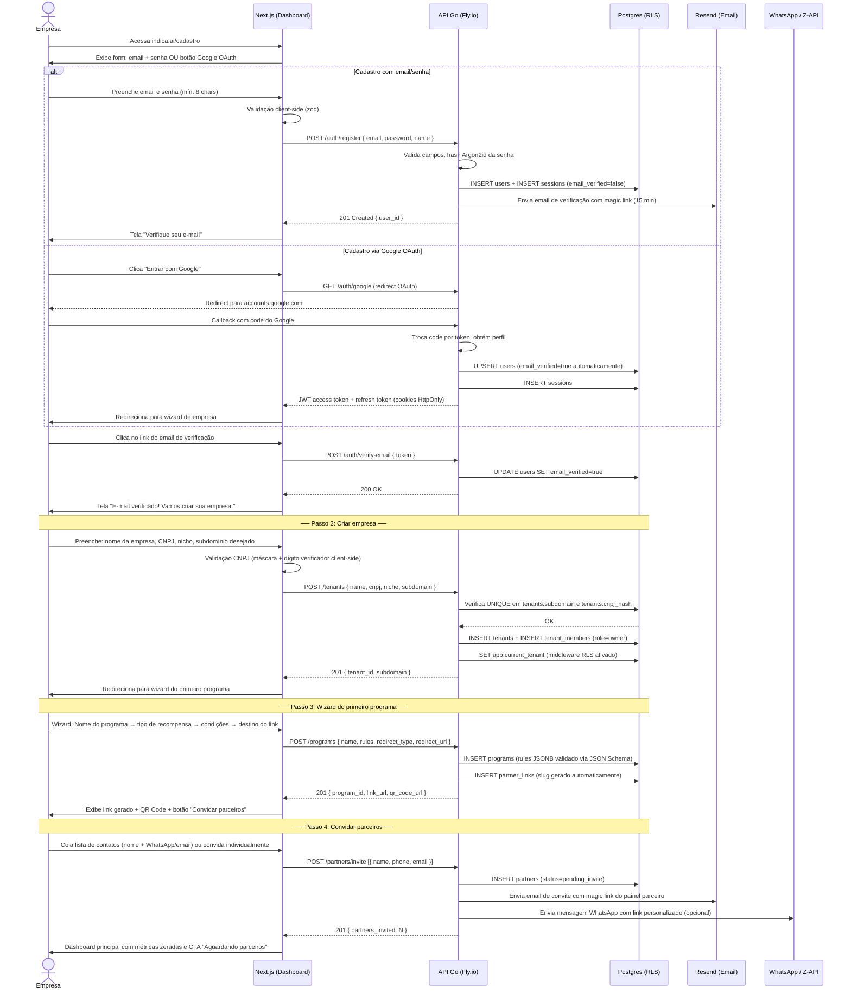
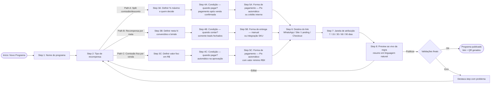
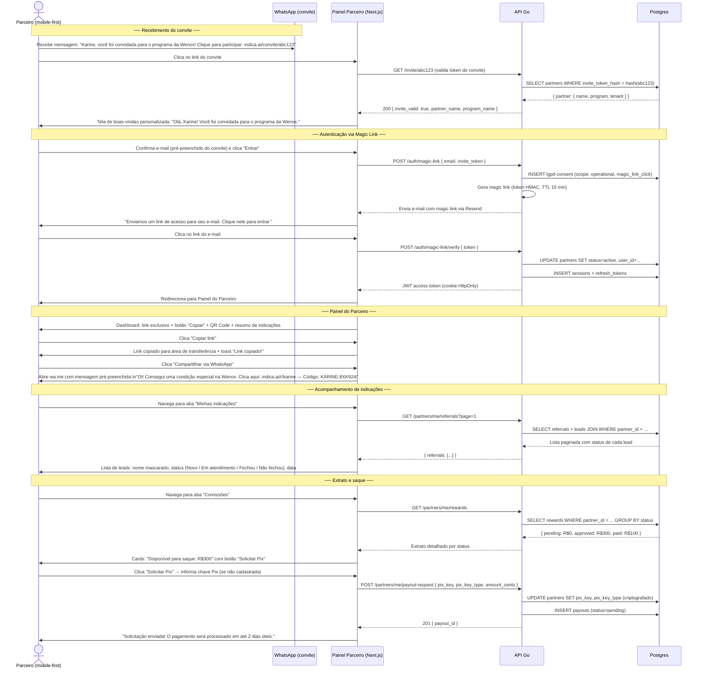
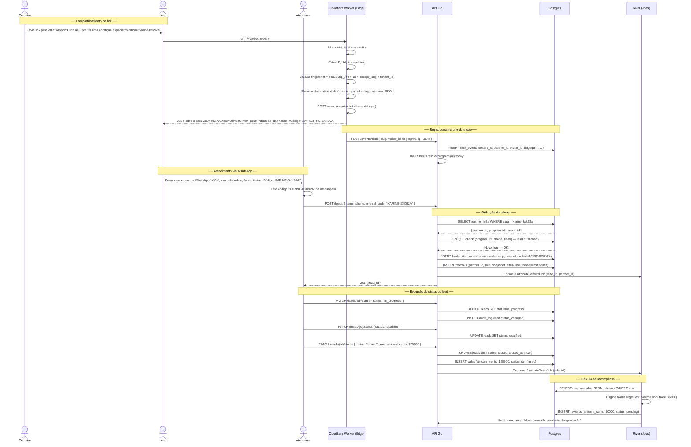
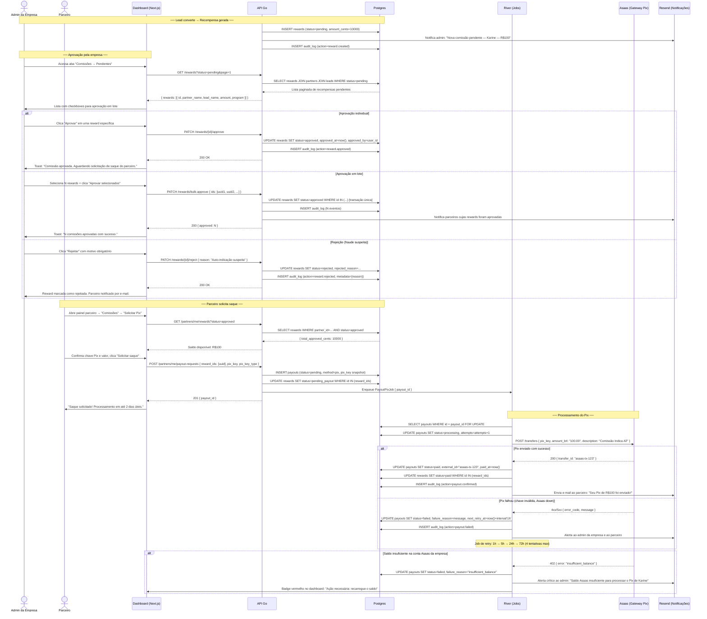
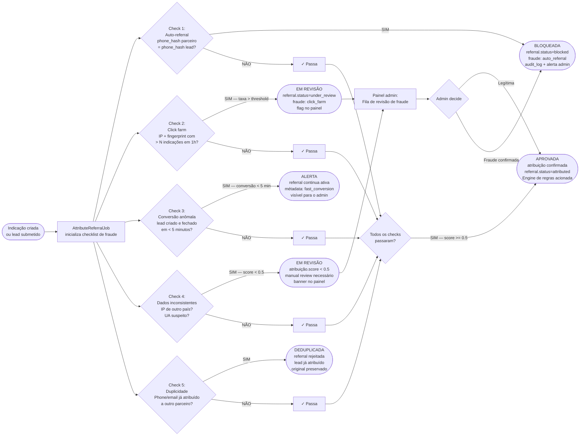

# Indica AÍ! — Fluxos de UX (v1.0)

> Documento produzido por @ux-chief | 2026-05-12  
> Dependências lidas: `product-spec.md`, `architecture.md`, `db-schema.md`, `lgpd-data-policy.md`  
> Plataforma: SaaS multi-tenant de programa de indicação, parceiros e recompensas. Operação BR, LGPD desde dia 1.

---

## Índice

1. [Fluxo 1 — Onboarding da Empresa](#fluxo-1--onboarding-da-empresa)
2. [Fluxo 2 — Criação de Programa com Motor de Regras](#fluxo-2--criação-de-programa-com-motor-de-regras)
3. [Fluxo 3 — Jornada do Parceiro](#fluxo-3--jornada-do-parceiro)
4. [Fluxo 4 — Indicação por WhatsApp](#fluxo-4--indicação-por-whatsapp)
5. [Fluxo 5 — Indicação por Site/Widget](#fluxo-5--indicação-por-sitewidget)
6. [Fluxo 6 — Aprovação de Comissão + Pagamento Pix](#fluxo-6--aprovação-de-comissão--pagamento-pix)
7. [Fluxo 7 — Exercício de Direitos LGPD](#fluxo-7--exercício-de-direitos-lgpd)
8. [Fluxo 8 — Detecção de Fraude](#fluxo-8--detecção-de-fraude)

---

## Fluxo 1 — Onboarding da Empresa

### Diagrama



### Narrativa de cada step

**Step 1 — Registro**
O usuário chega na landing de cadastro e escolhe entre e-mail/senha ou Google OAuth. No caminho e-mail, o sistema cria a conta com `email_verified=false` e dispara um magic link via Resend com TTL de 15 minutos. O formulário valida client-side antes de qualquer chamada à API (zod + react-hook-form), reduzindo round-trips desnecessários.

**Step 2 — Verificação de e-mail**
O link enviado por e-mail aponta para `/auth/verify-email?token=...`. A API valida o token (HMAC, não reversível), atualiza `users.email_verified = true` e emite os cookies de sessão (JWT access + refresh rotativo). O usuário não precisa fazer login de novo após verificar.

**Step 3 — Criação da empresa**
Formulário captura nome da empresa, CNPJ, nicho de atuação e subdomínio desejado (ex: `wenox.indica.ai`). A API verifica unicidade do subdomínio e do hash do CNPJ antes de persistir. O criador é automaticamente `tenant_member` com `role=owner`. A partir desse momento, o middleware `TenantInjector` injeta o `tenant_id` em toda transação.

**Step 4 — Wizard do primeiro programa**
Wizard de 4 passos guiado por linguagem natural. O usuário configura o motor de regras sem jargão técnico (ver Fluxo 2 para detalhe). Ao finalizar, o sistema gera o slug do link de indicação e o QR Code correspondente.

**Step 5 — Convite de parceiros**
O usuário pode importar uma lista CSV, digitar contatos individualmente ou copiar o link do programa para compartilhar manualmente. A API cria os registros de `partners` com `status=pending_invite` e dispara os convites.

**Step 6 — Dashboard**
Primeira tela do dashboard mostra métricas zeradas com guias contextuais ("Aguardando o primeiro parceiro se cadastrar", "Compartilhe o link do programa"). Um banner LGPD solicita que o usuário confirme a leitura dos termos antes de operacionalizar o programa.

### Exceções e Edge Cases

| Situação | Comportamento |
|----------|--------------|
| CNPJ já cadastrado em outro tenant | API retorna 409 Conflict. UI exibe: "Este CNPJ já possui uma conta. Faça login ou entre em contato com o suporte." |
| Subdomínio já ocupado | Sugestões automáticas de subdomínios alternativos (ex: `wenox2`, `wenox-indicacoes`). |
| E-mail não verificado tentando criar empresa | Middleware bloqueia. UI exibe banner persistente: "Confirme seu e-mail para continuar." com botão "Reenviar e-mail". |
| Link de verificação expirado (>15 min) | API retorna 401 com `reason: expired`. UI exibe botão "Enviar novo link". |
| Google OAuth com e-mail já cadastrado por senha | API faz merge das contas (UPSERT), mantém o hash de senha intacto e adiciona o provider OAuth. |
| Plano free — limite de 1 programa | Wizard conclui normalmente, mas ao tentar criar um 2º programa o sistema exibe paywall. |
| Falha no envio do e-mail (Resend down) | Job River `SendEmailJob` tem retry exponencial. UI informa ao usuário e oferece botão manual de reenvio. |

### Estados da UI

| Estado | Visual |
|--------|--------|
| **Loading** (chamada à API) | Botão desabilitado com spinner inline; campos do formulário `disabled`. |
| **Erro de validação** | Mensagens inline abaixo de cada campo (cor `destructive` do design system). |
| **Erro de rede/API** | Toast no canto superior direito: "Algo deu errado. Tente novamente." com botão de retry. |
| **Sucesso — e-mail enviado** | Tela dedicada com ilustração de envelope, texto do domínio do e-mail (ex: "Verifique seu Gmail") e contador de reenvio (60s). |
| **Sucesso — empresa criada** | Animação de confete leve + transição suave para wizard do programa. |
| **Sucesso — programa publicado** | Card com link copiável, QR Code para download (PNG/SVG) e botão de compartilhamento nativo (Web Share API). |

### Integrações Necessárias

- **Resend** — e-mail de verificação e convite de parceiros
- **Google OAuth 2.0** — login social
- **Cloudflare R2** — armazenamento do QR Code gerado
- **Postgres RLS** — isolamento imediato do tenant após criação
- **River** — job de reenvio de e-mail em caso de falha

---

## Fluxo 2 — Criação de Programa com Motor de Regras

### Diagrama



### Path A — Wenox: Split Comissão/Desconto Flexível

**Step 1 — Nome:** O usuário digita "Programa de Indicação Wenox" e a UI sugere um slug baseado no nome.

**Step 2 — Tipo de recompensa:** Card visual com 3 opções. Path A: "Comissão e desconto que o parceiro controla". Selecionado, a UI explica em linguagem natural: "O parceiro decide como usar o benefício: guardar como comissão, oferecer desconto ao cliente ou dividir".

**Step 3A — Configuração do split:** Slider ou campo numérico para o percentual máximo total (ex: 20%). O wizard pergunta: "Quem decide como o benefício é dividido?" — opções: "O parceiro decide em cada indicação" ou "A empresa define uma divisão padrão". O JSONB gerado é o `flexible_split` com as opções predefinidas (20/0, 10/10, 0/20, personalizado).

**Step 4A — Condição de pagamento:** "Quando o parceiro deve receber?" — o sistema exibe opções com exemplos: "Quando o lead fechar a venda (confirmação manual)" ou "Quando o pagamento for confirmado no sistema". Mapeado para o campo `trigger` do schema de regras.

**Step 5A — Forma de pagamento:** "Como pagar o parceiro?" — Pix automático (se chave Pix cadastrada) ou crédito em conta Indica AÍ! para usar em serviços. Um aviso aparece: "Para Pix automático, o parceiro precisa cadastrar a chave Pix no painel dele."

**Preview da regra (Step 8A):** O sistema gera um resumo como: *"Toda vez que um lead do Wenox fechar uma venda, o parceiro recebe até 20% de benefício — podendo dividir entre comissão no Pix e desconto para o cliente, conforme preferir."*

O JSON gerado:
```json
{
  "schema_version": 1,
  "trigger": "sale.confirmed",
  "attribution_window_days": 30,
  "conditions": [{ "op": "eq", "field": "lead.status", "value": "closed" }],
  "reward": {
    "type": "flexible_split",
    "max_pct": 20,
    "decision_by": "partner",
    "options": [
      { "commission_pct": 20, "discount_pct": 0 },
      { "commission_pct": 10, "discount_pct": 10 },
      { "commission_pct": 0,  "discount_pct": 20 },
      { "kind": "custom", "max_total_pct": 20 }
    ]
  },
  "payout": { "method": "pix", "schedule": "on_approval" }
}
```

### Path B — Ótica: Recompensa por Meta (5 indicações = óculos)

**Step 3B — Meta:** Campo numérico "Quantas indicações convertidas para ganhar o prêmio?" (ex: 5). O usuário define o brinde: texto livre ("Um óculos modelo X") ou SKU de produto. A UI avisa: "Indicações parciais ficam salvas — o parceiro verá o progresso em tempo real (ex: 3/5)."

**Step 4B — Condição:** "O que conta como indicação convertida?" — "Lead fechou a venda" (padrão). O worker `goal_evaluator` é acionado em toda mudança de status de lead para `closed`.

**Step 5B — Entrega do brinde:** "Como o prêmio será entregue?" — Manual (a empresa registra no painel) ou Integrado (via SKU configurado). No MVP, entrega manual.

**Preview B:** *"A cada 5 clientes indicados que comprarem na Ótica, o parceiro ganha um óculos. O progresso é exibido em tempo real no painel."*

### Path C — Ótica: Comissão Fixa por Venda

**Step 3C:** Campo de valor: "R$ por venda fechada" (ex: R$100). O slider de frequência define se a comissão é por venda única ou recorrente.

**Step 5C:** "Pix automático ou aprovação manual?" — Automático quando saldo da empresa for suficiente; manual se preferir revisar cada comissão.

**Preview C:** *"A cada cliente indicado que comprar, o parceiro recebe R$100 automaticamente no Pix após aprovação."*

### Exceções e Edge Cases

| Situação | Comportamento |
|----------|--------------|
| Publicar sem destino de link configurado | Validação bloqueia no Step 6. Toast: "Defina para onde o link deve levar antes de publicar." |
| Percentual de split > 100% | Validação client-side bloqueia imediatamente com feedback visual no slider. |
| Programa editado com indicações ativas | A UI exibe aviso: "Indicações já criadas com as regras anteriores não serão afetadas. Apenas novas indicações usarão as regras atualizadas." Confirmação obrigatória. |
| Tentativa de criar programa com nome duplicado dentro do tenant | Sugestão de nome alternativo com sufixo (ex: "Wenox 2026"). |
| JSON de regra inválido (bug no wizard) | A API retorna erro de validação de JSON Schema. UI exibe "Configuração inválida — entre em contato com o suporte" e registra o erro no Sentry. |
| Plano free com limite de tipos de recompensa | Paths B e C exibem badge "PRO" e cta de upgrade ao serem selecionados. |

### Estados da UI

| Estado | Visual |
|--------|--------|
| **Wizard em progresso** | Barra de progresso no topo com steps numerados. Step atual em destaque, steps concluídos com checkmark verde. |
| **Preview ao vivo** | Painel lateral colapsável que atualiza em tempo real conforme o usuário configura. Mostra o texto em linguagem natural e um card simulando o painel do parceiro. |
| **Validação inline** | Campos com erro ficam com borda vermelha; ícone de alerta com tooltip explicativo. |
| **Publicando** | Overlay com spinner e texto "Publicando seu programa..." — dura até confirmação da API. |
| **Publicado com sucesso** | Tela de celebração com QR Code, link copiável (botão "Copiar link") e botão "Convidar parceiros agora". |

### Integrações Necessárias

- **Postgres** — INSERT em `programs` com `rules JSONB` validado por JSON Schema
- **River** — job `GoalRecalcJob` registrado para programas do tipo `goal_based`
- **Cloudflare R2** — armazenamento do QR Code gerado para o programa
- **Cloudflare Worker KV** — cache de `slug → destination` para o tracking edge

---

## Fluxo 3 — Jornada do Parceiro

### Diagrama



### Narrativa de cada step

**Recebimento do convite:** O parceiro recebe uma mensagem no WhatsApp (via Twilio/Z-API) ou e-mail com um link de convite único e com prazo de validade (7 dias). A tela de boas-vindas é personalizada com o nome do parceiro e do programa.

**Autenticação via Magic Link:** Parceiros não usam senha — apenas magic link. Isso elimina fricção de cadastro (o parceiro não precisa memorizar mais uma senha) e é adequado para o perfil mobile-first. O consentimento LGPD operacional é registrado no momento do primeiro acesso.

**Painel do Parceiro:** Design mobile-first com navegação bottom tabs. A tela inicial exibe o link exclusivo com botão de cópia e QR Code, seguido de um resumo rápido ("3 indicações, R$100 disponíveis").

**Compartilhamento:** O botão "Compartilhar via WhatsApp" usa a Web Share API em mobile e um link `wa.me/` em desktop. A mensagem já vem pré-preenchida com o link e o código do parceiro — o parceiro só precisa selecionar o contato.

**Acompanhamento:** A lista de indicações mostra o nome do lead mascarado (ex: "Maria S.") para preservar privacidade, o status atual e a data. Em leads do tipo WhatsApp, o status é atualizado manualmente pela empresa.

**Saque Pix:** O parceiro vê três saldos: Pendente (aguardando aprovação da empresa), Aprovado (disponível para saque) e Pago (histórico). A solicitação de saque registra um snapshot da chave Pix no momento do pedido.

### Exceções e Edge Cases

| Situação | Comportamento |
|----------|--------------|
| Token de convite expirado | UI exibe: "Este link de convite expirou. Solicite um novo convite à empresa." |
| Magic link usado mais de uma vez | Token é invalidado no primeiro uso. Segundo uso retorna 401 com link para solicitar novo. |
| Parceiro sem comissões aprovadas tenta sacar | Botão "Solicitar Pix" desabilitado com tooltip: "Você não tem comissões aprovadas para saque." |
| Chave Pix inválida | Validação client-side por tipo (CPF: 11 dígitos, e-mail: formato válido, etc.) antes de enviar à API. |
| Saldo insuficiente na empresa para processar o saque | Payout fica em `pending` e a empresa é notificada por e-mail. O parceiro vê o status "Aguardando processamento". |
| Parceiro cadastrado manualmente (sem e-mail) | O acesso é restrito ao link de indicação público; painel só disponível após cadastrar e-mail. |

### Estados da UI

| Estado | Visual |
|--------|--------|
| **Loading do painel** | Skeleton loaders nas posições dos cards de métricas e da lista de indicações. |
| **Lista vazia (sem indicações)** | Ilustração "empty state" com texto motivacional e CTA "Compartilhe seu link agora". |
| **Indicação fechada** | Badge verde "Fechou" na linha da indicação + confete animado na primeira vez. |
| **Comissão aprovada** | Banner no topo: "Nova comissão aprovada! R$100 disponíveis para saque." |
| **Saque solicitado** | Card de status com tracker: "Solicitado → Em processamento → Pago". Timeline visual. |
| **Erro no magic link** | Tela com ilustração de link quebrado e botão "Solicitar novo link de acesso". |

### Integrações Necessárias

- **Resend** — e-mail com magic link de acesso
- **WhatsApp (Z-API / Twilio)** — envio do convite e mensagem pré-preenchida
- **Asaas** — processamento do Pix no saque
- **Postgres** — leitura de referrals, leads, rewards com RLS ativo para o partner_id

---

## Fluxo 4 — Indicação por WhatsApp

### Diagrama



### Narrativa de cada step

**Compartilhamento:** O parceiro copia o link do seu painel e manda no WhatsApp para um contato. O link `indica.ai/r/karine-8xk92a` é o hot path do sistema, respondido pelo Cloudflare Worker em menos de 50ms globalmente.

**Clique no link:** O Worker registra o clique de forma assíncrona (fire-and-forget), sem bloquear o redirect. O Lead é redirecionado imediatamente para o WhatsApp da empresa com a mensagem pré-preenchida contendo o código de rastreamento. Mesmo que o registro assíncrono falhe, o redirect já aconteceu.

**Mensagem pré-preenchida:** O texto é construído com `encodeURIComponent` no Worker: `Olá, vim pela indicação da Karine. Código: KARINE-8XK92A`. O atendente não precisa de nenhum sistema — lê o código diretamente na conversa do WhatsApp.

**Cadastro do lead pelo atendente:** O atendente entra no painel da empresa, abre "Novo Lead" e preenche nome, telefone e o código copiado da conversa. A API resolve o código para o parceiro correspondente e cria o referral com snapshot da regra vigente.

**Evolução do pipeline:** O lead passa pelos status: `new → in_progress → qualified → closed | lost`. Cada transição é registrada no `audit_log`. Quando o status muda para `closed`, o atendente informa o valor da venda (se aplicável) e o job de avaliação de regras é enfileirado automaticamente.

**Cálculo da recompensa:** O job `EvaluateRulesJob` lê o snapshot da regra no referral (não a regra atual do programa), calcula a recompensa e insere em `rewards` com status `pending`. A empresa é notificada para aprovar.

### Exceções e Edge Cases

| Situação | Comportamento |
|----------|--------------|
| Lead enviou a mensagem mas não usou o código | O atendente busca o lead por telefone no painel e atribui manualmente ao parceiro correspondente. |
| Código inválido ou mal digitado pelo atendente | API retorna 404 com mensagem: "Código de indicação não encontrado. Verifique e tente novamente." |
| Lead duplicado (mesmo telefone, mesmo programa) | API retorna 409. UI exibe: "Este telefone já está cadastrado neste programa como lead de [Parceiro X]." com opção de visualizar o lead existente. |
| Lead tenta se auto-indicar (parceiro e lead = mesma pessoa) | Job de anti-fraude detecta `phone_hash` idêntico. Reward bloqueada; audit_log registra `fraud.flag`. |
| Atendente fecha lead sem informar valor da venda (regras baseadas em % de venda) | A API solicita o campo `sale_amount_cents` obrigatoriamente quando `reward.type = commission_pct`. |
| Worker do Cloudflare indisponível | A API serve o fallback `/r/:slug` diretamente com latência maior mas funcionalidade mantida. |

### Estados da UI (painel do atendente)

| Estado | Visual |
|--------|--------|
| **Formulário de novo lead** | Campos: Nome, Telefone (máscara BR), Código de indicação. Campo "Código" com ícone de QR scan opcional. |
| **Código resolvido** | Ao sair do campo "Código", aparece chip verde: "Indicação de Karine — Programa Wenox". |
| **Lead criado** | Toast de sucesso + redirect para card do lead no pipeline kanban. |
| **Pipeline Kanban** | 4 colunas: Novos / Em atendimento / Qualificados / Fechados. Cada card com avatar, nome, telefone mascarado, tempo no status. |
| **Mudança de status** | Drag-and-drop entre colunas. Ao mover para "Fechado", modal solicita confirmação e valor da venda. |
| **Comissão gerada** | Badge amarelo no card: "Comissão pendente: R$100". Botão de aprovação disponível para admins. |

### Integrações Necessárias

- **Cloudflare Worker** — redirect do link e registro assíncrono do clique
- **Cloudflare KV** — cache de `slug → destination` para o Worker
- **Redis** — contador de cliques em tempo real
- **River** — jobs `AttributeReferralJob` e `EvaluateRulesJob`
- **Postgres** — INSERT em `leads`, `referrals`, `sales`, `rewards` com RLS

---

## Fluxo 5 — Indicação por Site/Widget

### Diagrama

```mermaid
sequenceDiagram
    actor Lead
    participant CF as Cloudflare Worker (Edge)
    participant Site as Site do Cliente (tenant)
    participant Widget as Widget JS (_iaref)
    participant API as API Go
    participant Redis as Redis (Idempotência)
    participant DB as Postgres
    participant River as River (Jobs)

    Note over Lead,CF: ── Clique no link de indicação ──

    Lead->>CF: GET /r/karine-8xk92a
    CF->>CF: Verifica cookie _iaref existente

    alt Cookie _iaref ausente (primeiro clique)
        CF->>CF: Gera visitor_id (UUIDv7)
        CF->>CF: Seta cookie: _iaref=visitor_id:slug:ts:hmac\n(Secure; SameSite=Lax; Max-Age=31536000; HttpOnly=false)
    else Cookie _iaref presente
        CF->>CF: Lê visitor_id existente (persistência entre sessões)
    end

    CF->>CF: POST async /events/click { slug, visitor_id, fingerprint, ip, ua }
    CF-->>Lead: 302 → https://cliente.com/?ref=karine-8xk92a

    Note over Lead,Widget: ── Navegação no site do cliente ──

    Lead->>Site: Navega pelo site do cliente
    Site->>Widget: Widget JS inicializa (script tag no <head>)
    Widget->>Widget: Lê ?ref=karine-8xk92a da URL
    Widget->>Widget: Lê cookie _iaref (visitor_id)
    Widget->>Widget: Preenche inputs ocultos:\n<input name="referral_code" value="karine-8xk92a">\n<input name="visitor_id" value="uuid-do-visitor">
    Widget->>Widget: Persiste ?ref na sessionStorage (navegação multi-página)

    Note over Lead,Site: ── Navegação multi-página (sem cookie de terceiro) ──

    Lead->>Site: Clica em links internos, navega para página de produto
    Widget->>Widget: Ao cada page load: lê sessionStorage + propaga ?ref na URL
    Widget->>Widget: Mantém referral_code nos formulários de todas as páginas

    Note over Lead,DB: ── Preenchimento e envio do formulário ──

    Lead->>Site: Preenche formulário de contato/cadastro/checkout
    Lead->>Site: Submete formulário
    Site->>API: POST /leads { name, phone, email, referral_code: "karine-8xk92a",\n visitor_id: "uuid", form_data: {...} }\nHeader: X-API-Key: tenant_api_key\nHeader: Idempotency-Key: uuid-do-form

    Note over API,Redis: ── Verificação de idempotência ──

    API->>Redis: GET idempotency:uuid-do-form
    Redis-->>API: null (primeira requisição)
    API->>Redis: SET idempotency:uuid-do-form "processing" EX 86400

    Note over API,DB: ── Atribuição por código + cookie ──

    API->>DB: Verifica referral_code "karine-8xk92a" → partner_id, tenant_id
    DB-->>API: { partner_id, program_id } com score=1.0 (code_match)

    alt Sem referral_code mas com visitor_id
        API->>DB: SELECT click_events WHERE visitor_id = $visitor_id\nAND occurred_at >= NOW() - INTERVAL '30 days'\nORDER BY occurred_at DESC LIMIT 1
        DB-->>API: { partner_id, slug } com score=0.85 (cookie_match)
    end

    alt Sem código nem cookie (fingerprint fallback)
        API->>DB: SELECT click_events WHERE fingerprint = $fp\nAND occurred_at >= NOW() - INTERVAL '30 days'\nORDER BY occurred_at DESC LIMIT 1
        DB-->>API: { partner_id } com score=0.4 (fingerprint_match — baixa confiança)
    end

    API->>DB: UNIQUE check (program_id, phone_hash)
    DB-->>API: Lead novo — OK
    API->>DB: INSERT leads (status=new, source=widget)
    API->>DB: INSERT referrals (attribution_score=1.0, model=last_touch)
    API->>River: Enqueue AttributeReferralJob
    API->>Redis: SET idempotency:uuid-do-form "completed:{lead_id}" EX 86400
    API-->>Site: 201 { lead_id, referral_attributed: true }
    Site-->>Lead: Página de agradecimento / próximo passo do checkout
```

### Narrativa de cada step

**Clique no link:** O Worker do Cloudflare intercepta o clique, seta o cookie `_iaref` de primeira parte (se ausente) e redireciona para o site do cliente com o parâmetro `?ref=slug` na URL. O cookie é assinado com HMAC para evitar forja — mas `HttpOnly=false` porque o widget JS precisa lê-lo.

**Widget JS no site do cliente:** O widget é um script leve (~5KB gzip) que o cliente instala via `<script>` ou GTM. Ele faz três coisas: (1) lê o `?ref=` da URL, (2) preenche inputs ocultos nos formulários e (3) persiste o referral_code na sessionStorage para navegação multi-página sem dependência de cookies de terceiros.

**Navegação multi-página:** À cada carregamento de página, o widget relê o sessionStorage e repropaga o `?ref=` na URL (via `history.replaceState`) e nos formulários. Isso garante que mesmo que o lead abra 10 páginas antes de converter, a atribuição persiste.

**Submit do formulário:** O widget intercepta o `submit` do formulário, adiciona os campos ocultos `referral_code` e `visitor_id` ao payload, e envia para a API usando o `X-API-Key` do tenant. O `Idempotency-Key` (UUID gerado pelo widget para cada sessão de formulário) evita registros duplicados em caso de duplo clique ou retry.

**Hierarquia de atribuição:** A API tenta atribuir por três métodos em ordem de confiança: (1) código explícito no formulário (`score=1.0`), (2) visitor_id do cookie (`score=0.85`), (3) fingerprint de rede (`score=0.4`). Apenas o método com maior score é usado. Atribuições com `score < 0.5` ficam marcadas como `pending_review`.

**Janela de atribuição:** O campo `attribution_window_days` do programa (padrão 30 dias) define até quando cliques anteriores são considerados para atribuição. Um clique de 45 dias atrás em um programa com janela de 30 dias não é elegível.

### Exceções e Edge Cases

| Situação | Comportamento |
|----------|--------------|
| Usuário bloqueou cookies | O widget opera sem cookie; usa apenas `?ref=` da URL e sessionStorage. Atribuição por fingerprint como fallback. Score baixo = revisão manual. |
| Formulário enviado em SPA (Single Page App) sem reload | Widget expõe método `window.indicaAI.getPayload()` para o time de frontend do cliente integrar manualmente ao submit. |
| Site do cliente não instala o widget | Apenas o modo WhatsApp fica disponível. O link `/r/:slug` ainda funciona e registra o clique. |
| Idempotency-Key reutilizado (retry do browser) | API detecta "completed:{lead_id}" no Redis e retorna 200 com o mesmo `lead_id`, sem duplicar. |
| Score 0.4 (só fingerprint) com múltiplos cliques de IPs similares | Job de atribuição fica em `pending`. O painel da empresa exibe o lead em "Atribuição pendente de revisão" com botão de atribuição manual. |
| Lead converte em dispositivo diferente do clique (ex: clicou no celular, converteu no PC) | Sem cookie nem fingerprint matching. O referral_code no formulário é a única ancora — se o lead não chegou via `?ref=`, não há atribuição automática. Empresa pode atribuir manualmente. |

### Estados da UI

| Estado | Visual (widget no site do cliente) |
|--------|------------------------------------|
| **Referral detectado** | Nenhum visual intrusivo (widget é invisible por padrão). Apenas os inputs hidden são populados. |
| **Modo analytics ativo** | Banner de cookie consent no rodapé do site (implementado pelo cliente com API do widget). |
| **Formulário submetido com sucesso** | O widget não interfere — a UX de confirmação é do site do cliente. |

| Estado | Visual (painel da empresa) |
|--------|---------------------------|
| **Lead chegou via widget** | Badge "Widget" na origem do lead. |
| **Atribuição pendente** | Badge amarelo "Revisão de atribuição" com botão de atribuição manual e histórico de cliques. |
| **Atribuição confirmada** | Badge verde com nome do parceiro e score de confiança. |

### Integrações Necessárias

- **Cloudflare Worker** — leitura/escrita do cookie `_iaref` e redirect
- **Widget JS** (`web/packages/tracking/`) — população de inputs, sessionStorage, Idempotency-Key
- **Redis** — cache de idempotência (TTL 24h)
- **Postgres** — lookup de click_events por visitor_id e fingerprint para atribuição
- **River** — job `AttributeReferralJob` com lógica de scoring

---

## Fluxo 6 — Aprovação de Comissão + Pagamento Pix

### Diagrama



### Narrativa de cada step

**Geração da recompensa:** Quando um lead muda de status para `closed` (ou o trigger configurado é disparado), o job `EvaluateRulesJob` calcula a recompensa e insere em `rewards` com `status=pending`. Um e-mail é disparado para o admin da empresa.

**Painel de comissões:** O admin vê uma lista filtrada de comissões pendentes com informações do parceiro, lead relacionado e valor. É possível aprovar individualmente (para casos que merecem análise) ou em lote (para aprovação automatizada no final do mês).

**Aprovação em lote:** A API executa o UPDATE em transação única para garantir atomicidade — ou todas aprovam ou nenhuma. Parceiros são notificados por e-mail individualmente.

**Rejeição com motivo:** Quando uma comissão é rejeitada, o motivo é obrigatório e fica registrado no `audit_log`. O parceiro recebe e-mail explicando a rejeição (sem expor dados internos de antifraude).

**Solicitação de saque:** O parceiro vê o saldo disponível (apenas rewards com `status=approved`) e solicita o Pix. A API faz snapshot da chave Pix naquele momento (campo `payouts.pix_key`) — se o parceiro mudar a chave depois, o pagamento vai para a chave que estava ativa na solicitação.

**Processamento pelo job:** O `PayoutPixJob` usa `FOR UPDATE` na leitura do payout para evitar processamento duplicado em caso de retry. A integração com o Asaas segue o modelo de transferência direta.

**Retry em caso de falha:** O sistema tenta até 4 vezes com intervalos crescentes (1h, 5h, 24h, 72h). Após a última falha, o payout fica em `status=failed` e aparece no painel da empresa como "dead-letter" com botão de replay manual.

### Exceções e Edge Cases

| Situação | Comportamento |
|----------|--------------|
| Empresa tenta aprovar reward já aprovada | API retorna 409 com `already_approved`. Idempotente. |
| Parceiro sem chave Pix cadastrada | Botão de saque exibe modal obrigatório de cadastro de chave Pix. |
| Chave Pix do parceiro inválida no Asaas | Job falha com `failure_reason="pix_key_invalid"`. E-mail orienta o parceiro a atualizar a chave. |
| Empresa com saldo Asaas zerado | Alerta no dashboard da empresa com link para recarregar a conta Asaas. Payout fica em fila até saldo reposto e replay manual. |
| Parceiro muda a chave Pix entre solicitação e processamento | O payout usa o snapshot da chave registrada na solicitação (`payouts.pix_key`). A nova chave só vale para saques futuros. |
| Admin aprova reward de parceiro com indicação fraudulenta já detectada | A UI exibe aviso amarelo: "Esta indicação possui flag de fraude. Confirmar aprovação?" com botão de visualizar o relatório de fraude. |

### Estados da UI

| Estado | Visual |
|--------|--------|
| **Lista de comissões pendentes** | Tabela com filtros (por programa, parceiro, valor, período). Checkboxes para seleção em lote. |
| **Aprovação em progresso** | Spinner inline no botão "Aprovar". Linha da tabela fica em estado "desabilitado" durante o processamento. |
| **Reward aprovada** | Badge muda de "Pendente" (amarelo) para "Aprovada" (verde) sem reload de página (TanStack Query invalidation). |
| **Saque em processamento** | Timeline no painel do parceiro: "Solicitado ✓ → Em processamento ⏳ → Pago". |
| **Pix enviado** | Badge "Pago" verde com ícone de Pix + data/hora. Link para comprovante Asaas (se disponível). |
| **Falha no Pix** | Badge "Falha" vermelho com botão "Ver motivo" e botão "Tentar novamente" (para admin). |

### Integrações Necessárias

- **Asaas** — gateway de Pix (transferência direta)
- **Resend** — notificações para admin (reward pendente, falha) e parceiro (aprovação, saque enviado)
- **River** — jobs `PayoutPixJob` (com retry exponencial) e `EvaluateRulesJob`
- **Redis** — idempotência do job de payout (evita duplo processamento)
- **Postgres** — transações atômicas em rewards + payouts com RLS

---

## Fluxo 7 — Exercício de Direitos LGPD

### Diagrama

```mermaid
graph LR
    A([Titular acessa\n/meus-dados]) --> B{Escolhe o direito}

    B -->|Exportação de dados\nart. 18 I e V| C1
    B -->|Anonimização\nart. 18 IV| D1
    B -->|Gerenciar consentimentos\nart. 18 IX| E1

    %% Path A: Exportação
    C1[Solicita exportação\nPOST /lgpd/requests\n{type: access}] --> C2[Status: identity_pending\nMagic link enviado por email]
    C2 --> C3{Titular clica\nno magic link}
    C3 -->|Link válido\n< 15 min| C4[Identidade verificada\nStatus: processing]
    C3 -->|Link expirado| C3E[Erro: link expirado\nNovo link enviado automaticamente]
    C3E --> C2
    C4 --> C5[ExportDataJob enfileirado\nColeta dados de todas as tabelas]
    C5 --> C6[ZIP gerado com subpastas\nupload para Cloudflare R2]
    C6 --> C7[URL assinada R2\nválida por 7 dias]
    C7 --> C8[E-mail enviado ao titular\ncom link de download]
    C8 --> C9[audit_log: pii.export]
    C9 --> C10([Status: completed\nTitular baixa ZIP])

    %% Path B: Anonimização
    D1[Solicita anonimização\nPOST /lgpd/requests\n{type: anonymization}] --> D2[Status: identity_pending\nMagic link enviado]
    D2 --> D3{Titular clica\nno magic link}
    D3 -->|Link válido| D4[Tela de confirmação\ncom aviso de irreversibilidade]
    D4 --> D5{Titular confirma\ncom 2FA ou senha}
    D5 -->|Confirmado| D6[AnonymizeDataJob enfileirado]
    D5 -->|Cancelado| D5C([Solicitação cancelada\nNenhum dado alterado])
    D6 --> D7{Verifica dados\ncom obrigação fiscal}
    D7 -->|Sem pendências fiscais| D8[anonymize_user executado\nem todos os tipos]
    D7 -->|Com pendências fiscais\ne.g. pix_key em payout ativo| D9[Anonimiza campos elegíveis\nRetém campos fiscais até prazo]
    D8 --> D10[Sessões invalidadas\nConsentimentos revogados]
    D9 --> D10
    D10 --> D11[audit_log: pii.anonymized]
    D11 --> D12([Status: completed\nDados irreversívelmente anonimizados])

    %% Path C: Consentimentos
    E1[Tela de Gerenciar\nConsentimentos] --> E2[Lista de escopos com toggles:\noperacional | marketing_email |\nmarketing_whatsapp | analytics_cookies]
    E2 -->|Toggle OFF em escopo não-operacional| E3[POST /me/consent/revoke\n{scopes: escopos_revogados}]
    E3 --> E4[consents.revoked_at = NOW\nTimestamp imediato]
    E4 --> E5{Escopo revogado?}
    E5 -->|marketing_email| E6[Job: desinscreve das listas\nde email via Resend API]
    E5 -->|marketing_whatsapp| E7[Job: desinscreve de notificações\nWhatsApp não-operacionais]
    E5 -->|analytics_cookies| E8[Cookie _iaref mantido\npara fins operacionais\nanalíticas agregadas cessam]
    E6 --> E9[audit_log: consent.revoked]
    E7 --> E9
    E8 --> E9
    E9 --> E10([Confirmação ao titular\ncom timestamp do registro])
```

### Narrativa — Path A: Exportação de Dados

**Solicitação:** O titular (parceiro, admin da empresa ou lead) acessa `/meus-dados` no painel ou envia um e-mail para `privacidade@indica.ai`. Via painel, um formulário simples pergunta "O que você quer fazer?" com as opções listadas. Ao escolher "Exportar meus dados", a API cria um registro em `lgpd_requests` com `status=identity_pending`.

**Verificação de identidade:** Um magic link é enviado por e-mail para o endereço cadastrado. O titular tem 15 minutos para clicar. Esse passo existe para impedir que terceiros solicitem exportações de dados alheios.

**Coleta dos dados:** O `ExportDataJob` (River) coleta todos os dados pessoais do titular em todas as tabelas relevantes: cadastro, indicações, recompensas, pagamentos, consentimentos e requests LGPD próprias. Dados de outros titulares não são incluídos. A coleta usa o `user_id` do solicitante como âncora, com RLS ativo.

**Entrega:** Um arquivo ZIP estruturado é gerado com subpastas por entidade (`/perfil/`, `/indicacoes/`, `/pagamentos/`, etc.) e um arquivo `README.txt` explicando o conteúdo. O upload vai para o bucket privado `lgpd-exports` no R2, e uma URL assinada válida por 7 dias é gerada e enviada por e-mail.

**SLA:** 15 dias corridos. Na prática, o job executa em minutos. A LGPD não define prazo explícito para o titular — seguimos boas práticas da GDPR (30 dias) mas estabelecemos 15 dias como meta interna.

### Narrativa — Path B: Anonimização

**Solicitação e verificação:** Mesmo fluxo de magic link. Após verificação, o sistema exibe uma tela de confirmação com linguagem clara sobre a irreversibilidade: "Seus dados pessoais (nome, e-mail, telefone) serão substituídos por valores anônimos. Esta ação não pode ser desfeita."

**Confirmação com 2FA/senha:** Para ações irreversíveis, exige-se confirmação adicional: senha atual (para usuários com senha) ou um código OTP de 6 dígitos enviado por SMS/e-mail. Isso evita ações acidentais.

**Execução seletiva:** O sistema verifica se há dados com obrigação fiscal antes de anonimizar. Chaves Pix associadas a payouts com nota fiscal emitida (campo `fiscal_doc_ref`) não são anonimizadas até o prazo fiscal expirar (5 anos). O titular é informado claramente sobre quais dados foram anonimizados agora e quais aguardam o prazo legal.

**Efeitos imediatos:** Todas as sessões ativas são invalidadas. Todos os refresh tokens da family são revogados. O titular não consegue mais fazer login — a conta está efetivamente encerrada. Dados operacionais (hashes, aggregados, referências) são preservados para integridade do sistema.

### Narrativa — Path C: Gerenciar Consentimentos

**Tela de preferências:** Uma lista clara dos escopos com o status atual de cada um (toggle ativo/inativo). O escopo `operational` aparece como fixo (não pode ser desativado) com tooltip explicando: "Necessário para execução do programa de indicação".

**Revogação imediata:** Ao desativar um escopo, o `revoked_at` é registrado imediatamente com timestamp preciso. A API dispara um job para cada tipo:
- `marketing_email`: chama a API do Resend para desinscrever das listas
- `marketing_whatsapp`: registra preferência de não-contato para comunicações não-operacionais
- `analytics_cookies`: o widget JS para de criar cookies novos na próxima sessão; dados históricos permanecem (base legal de legítimo interesse para anti-fraude)

**Distinção importante:** Revogar consentimento não é o mesmo que solicitar anonimização. O titular recebe confirmação com o timestamp e é informado: "Seus dados continuam armazenados conforme a política de retenção. Se deseja que sejam removidos, solicite a anonimização."

### Exceções e Edge Cases

| Situação | Comportamento |
|----------|--------------|
| Magic link de verificação expirado (>15 min) | API invalida o token, cria novo automaticamente e reenvia. Status permanece `identity_pending`. |
| Titular solicita exportação antes da primeira expirar | API detecta request `processing` ou `completed` recente e informa: "Você já tem uma exportação recente. [Ver link de download]." |
| Titular solicita anonimização e tem payouts pendentes de aprovação | Sistema informa: "Você possui comissões pendentes de R$X. Após a anonimização, elas serão atribuídas ao seu histórico mas o pagamento será processado para a chave Pix registrada antes da anonimização." |
| Titular (lead) nunca se cadastrou na plataforma (sem conta) | Acesso via formulário público em `/lgpd/solicitar` com validação de identidade por e-mail + telefone. SLA de processamento manual pelo DPO. |
| Dados de leads em múltiplos tenants | A exportação cobre apenas o tenant de onde o request foi feito. Para outros tenants, o titular deve contatar cada empresa cliente diretamente (elas são as controladoras). |

### Estados da UI

| Estado | Visual |
|--------|--------|
| **Tela /meus-dados** | Cards com os 3 direitos exercitáveis, ícones representativos, descrição simples e botão de ação. |
| **Aguardando verificação** | Animação de e-mail + texto: "Enviamos um e-mail para [e-mail mascarado]. Clique no link para confirmar." + contador de expiração (15:00 decrescente). |
| **Processando exportação** | Barra de progresso indeterminada + texto: "Estamos coletando seus dados. Você receberá um e-mail quando estiver pronto." |
| **Exportação pronta** | Banner verde com botão de download e aviso: "Este link expira em 7 dias." |
| **Confirmação de anonimização** | Modal com fundo vermelho suave, ícone de alerta, texto em vermelho: "Esta ação é irreversível". Botão de confirmação exige digitar a palavra "CONFIRMAR". |
| **Anonimização concluída** | Tela branca com mensagem: "Seus dados foram anonimizados. Esta sessão será encerrada." + countdown de logout (5s). |
| **Toggles de consentimento** | Toggle switches com label do escopo, descrição do que ele permite e badge de base legal. |

### Integrações Necessárias

- **Resend** — e-mail de magic link, notificação de exportação pronta, e-mail de confirmação de anonimização
- **Cloudflare R2** — bucket `lgpd-exports` (privado) com URLs assinadas (TTL 7 dias)
- **River** — jobs `ExportDataJob`, `AnonymizeDataJob`, `ConsentRevocationJob`
- **Postgres** — função `anonymize_user()` executada em transação com auditoria
- **Redis** — rate limit em endpoints LGPD (máximo 5 requests/hora por titular)

---

## Fluxo 8 — Detecção de Fraude

### Diagrama



### Narrativa de cada check

**Check 1 — Auto-referral (bloqueio imediato):** O sistema compara o `phone_hash` do parceiro com o `phone_hash` do lead. Se forem idênticos, a indicação é bloqueada imediatamente — sem exceções. O mesmo check é feito com `email_hash`. Também verifica se o IP do clique (`click_events.ip_inet /24`) coincide com o IP de conversão em um intervalo curto, o que pode indicar o parceiro usando outro dispositivo para se auto-indicar. Resultado: `referral.status = 'blocked'`, audit_log com `fraud.flag`.

**Check 2 — Click farm (rate limiting por IP):** O Worker do Cloudflare aplica rate limiting de 300 req/min por IP no endpoint `/r/:slug`. Na camada de análise, um job periódico verifica a relação `cliques únicos / cliques totais` por parceiro em uma janela de 1 hora. Se a razão de visitantes únicos for menor que 10% do total de cliques, é sinal de inflation artificial. A indicação vai para revisão manual — não é bloqueada automaticamente, pois pode haver contexto legítimo.

**Check 3 — Conversão ultrarrápida (alerta, não bloqueio):** Se um lead é criado e imediatamente marcado como fechado em menos de 5 minutos (configurável por programa), um alerta é registrado nos metadados da reward: `metadata.fast_conversion = true`. Não bloqueia automaticamente — a empresa pode ter um processo de venda ultrarrápido — mas fica visível no painel para análise.

**Check 4 — Dados inconsistentes (scoring de atribuição):** Se o IP do clique é de outro país e o número de telefone é brasileiro, o score de confiança da atribuição cai. Se o User Agent não é reconhecível (bot, scraper) ou o fingerprint está na lista de dispositivos suspeitos, o score pode cair abaixo do threshold de 0.5. Atribuições com score < 0.5 ficam em `pending_review` no painel da empresa.

**Check 5 — Deduplicação:** O banco tem `UNIQUE(program_id, phone_hash)` que impede o mesmo lead de ser registrado duas vezes no mesmo programa, independentemente do parceiro. Se um lead chega via outro link depois de já ter sido atribuído ao Parceiro A, a segunda indicação é rejeitada e o Parceiro A mantém a atribuição original (modelo "first touch" em disputa de atribuição).

**Fila de revisão manual:** Indicações em `under_review` aparecem em uma seção dedicada do painel da empresa com todas as evidências: histórico de cliques, IPs, timestamps, score e o motivo do flag. O admin pode aprovar (libera o fluxo normal) ou rejeitar definitivamente.

### Exceções e Edge Cases

| Situação | Comportamento |
|----------|--------------|
| Parceiro legítimo com conversão rápida (e-commerce com checkout 1-click) | Admin pode configurar o threshold de conversão rápida por programa (ou desabilitar o check). |
| Empresa com time de vendas rápido que fecha no mesmo dia | O check 3 é configurável. O padrão de 5 minutos pode ser ajustado nas configurações do programa. |
| Parceiro viajando no exterior (IP de outro país, legítimo) | O score cai mas não bloqueia. O parceiro pode entrar em contato com o suporte para ter a indicação manualmente aprovada. |
| Bot legítimo de parceiro (integração via API) | Parceiros que integram via API usam API key — não passam pelo tracking edge e não têm fingerprint de browser. O campo `source=api` é tratado diferentemente nos checks. |
| Empresa com alto volume de indicações quer automatizar aprovação | Configuração por programa: `auto_approve_if_score >= 0.85`. Indicações com score alto são aprovadas diretamente sem fila manual. |
| Admin rejeita como fraude uma indicação legítima | Um botão "Contestar rejeição" está disponível por 30 dias. A contestação cria um ticket no suporte. |

### Estados da UI

| Estado | Visual |
|--------|--------|
| **Indicação aprovada** | Badge verde "Atribuída" com score de confiança (ex: "Score: 1.0 — código direto"). |
| **Indicação bloqueada** | Badge vermelho "Bloqueada — Auto-indicação". Visível apenas para admins, não para o parceiro. |
| **Em revisão** | Badge amarelo "Em revisão" na lista de indicações. Ícone de alerta com tooltip mostrando o motivo. |
| **Fila de revisão de fraude** | Seção dedicada no painel admin com cards de cada indicação suspeita, evidências compactas e botões "Aprovar" / "Rejeitar". |
| **Alerta de conversão rápida** | Ícone de relógio no card da indicação com tooltip: "Este lead foi fechado 3 minutos após a criação." |
| **Score baixo** | Barra de confiança colorida (verde > 0.85, amarelo 0.5–0.85, vermelho < 0.5) ao lado de cada atribuição. |

### Integrações Necessárias

- **Redis** — rate limiting por IP no Worker (token bucket via Lua) e contadores de cliques em tempo real
- **River** — job `AttributeReferralJob` com todos os checks encadeados
- **Postgres** — UNIQUE constraints (`program_id, phone_hash`), índices em `click_events` para análise de fingerprint, `audit_log` append-only para `fraud.flag`
- **Resend** — alerta por e-mail ao admin quando fraude é detectada (auto-referral bloqueado ou fila de revisão com N itens)
- **Sentry** — captura de erros no job de detecção com contexto de `tenant_id` e `referral_id`

---

## Apêndice — Mapa de Integrações por Fluxo

| Integração | Fluxos que usa | Finalidade |
|------------|---------------|------------|
| **Cloudflare Worker** | F4, F5 | Redirect do link, cookie 1st-party, registro assíncrono de clique |
| **Cloudflare KV** | F4, F5 | Cache de `slug → destination` para o Worker |
| **Cloudflare R2** | F1, F7 | QR Codes, exportações LGPD |
| **Postgres (RLS)** | Todos | Isolamento multi-tenant em toda operação |
| **River (Jobs)** | F1, F4, F5, F6, F7, F8 | Processamento assíncrono de recompensas, payouts, LGPD, fraude |
| **Redis** | F5, F6, F8 | Idempotência, rate limit, contadores |
| **Resend** | F1, F3, F6, F7, F8 | E-mails transacionais (verificação, magic link, notificações) |
| **WhatsApp / Z-API** | F1, F3, F4 | Convites, mensagem pré-preenchida, rastreamento |
| **Asaas (Pix)** | F6 | Processamento de pagamentos |
| **Sentry** | F2, F8 | Captura de erros em jobs críticos |

---

*Próxima etapa: **ETAPA 5 — Desenvolvimento Backend** (`@backend-chief`)*
*Dependências: este documento deve ser lido pelo `@backend-chief` (especialmente F4, F5 para tracking engine e F6 para payout) e pelo `@frontend-chief` (F1, F2, F3 para dashboard e painel parceiro).*

*Versão 1.0 — @ux-chief — 2026-05-12*
